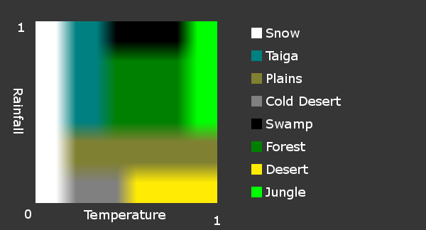

```
#
# @file   : libre-gaming-manifest.md
# @version: 2021-04-09
# @created: 2019-02-01
# @author : pyramid
#
```


**Introduction**
=====================================

**Libre Gaming Manifest** slogan - The collection that makes your games enticing!

**Libre Gaming Manifest** (LGM) is a working title for what is to become a collection of ideas, practices, and tools for aiding and advancing the creative development of libre games (as in unrestricted in creativity by copyright or liability concerns) games. Manifest as in an ordered list (not as in manifesto, a declaration).

Other potential candidates pondered for a release title were
- Libre Games Library (LGL)
- Libre Games Laboratory (LGL)

We live in a world where economic concerns play a more or less part of our daily tasks and duties. Nevertheless, there are many that are willing or eager invest their spare time by engage their creativity on some task of their own satisfaction. One of those tasks can be game creation.

**Why create games?**
Due to the narrative and artistic aspects added to technological development, game creation is as diverse as it can get. In game creation, there is room for many types of creativity, be it writing stories, scenes, or narratives, be it artistic content creation of all kinds, like images, textures, 3d models, animation, sound, music, cinematography, world, or character creation, through to the more structured creativity of the kind of programming, coding, conceptualization, organization, management, public relation, or documentation. There is space for almost any type of creativity or interest.

Libre game creation not only challenges but also brings fun, utilizing your free time while benefiting all humanity, and can be a much more rewarding (if not even therapeutic) escape from the harsh reality of our life ('cause she is equally a harsh mistress). Creative engagement presents a much better reality escape route than e.g. television, web surfing, or drugs. It further presents a excellent playing field for personal growth.

Still, even in the age of global tech giants living off libre software without returns to original developers, we advocate the establishment of structures that will enable creators to fully exercise their creativity with as few obstacles as possible.

This project is an attempt at removing obstacles and reducing challenges found by contemporary and future libre game creators and developers.

It is initially approached from a "*tabula rasa*" point of view and is targeted for entry-level green-horn noobs with creative powers.


## Game Types

While we focus our attention on 3D words, the collected and established best practices may be useful to other game types.

We are a community of contributors to existing libre game projects and a forum for exchanging ideas and current and future practices in libre gaming.

We aggregate, collect, discuss but do not create games within this community. The latter is reserved to individual project communities and groups.


## Game Vision

The originator, aka pyramid, envisions a cinematographic exploratory free-style open-universe first-person adventure role playing game that is non-repetitive enticing and at the same time rewards the player for his spent time.

Think about a holodeckesque style of game as the guiding vision.

It should be a large cosmos possibilities and opportunities populated by star systems with spacefaring mechanics as well as possibility of roaming entire planets (or any other objects in space), in atmosphere, on the surface, on and sub-liquid, or below ground. Ships, buildings, structures, space stations, caves should be walkable and explorable.

Further specifics will be discussed in later chapters keeping in mind that an exemplary fantasy game may as well utilize a subset of the envisioned mechanics.


## Libre Source Games

Because (for those who care)

- we don't need repeated effort for the same type of games over and over and again
- for-benefit of many is more desirable than for-profit for few
- we must not be indirectly responsible for low-wage coding sweat shops
- we may be the only ones to boss oneself around
- creativity shall be free
- through creativity and safe play we learn to be gods in the overarching game play of life
- because we can


## Libre Source

Think twice, investigate, read or listen to opinions, if you expect to be making a living from open source. Though not impossible or unheard of, it requires a lot of commercial overhead.

Most of open source developers ate employed individuals who choose to spend their free time doing something they consider useful while at the same time keeping their mind active and well exercised.

You must also be prepared for commercial organizations to sell and use your open code without any return to the original developers.
This is the nature of open source.
Be sure that you are prepared to walk this path.


## Headsup Advice

- corporate strongarms will steal your work
- open source community has elements that do not care about responsibility or diligence
- the attrition and abandonment culture of some open projects can be nerve-straining
- some of the github project leaders' neglect of merging pull requests is outright disrespectful
- while open source should strive for unity   of solutions, the previous realities lead to unsustainable fragmentation
- your body is the vehicle for your mind. the healthier the better your contributions
- equally, emotional health allows for better creativity and contributions
- there is naysayers, apes and savages in t-shirts abound, and they will be out to get you. just keep cool and detached.
- as all roads, this one is also full of sweat and disappointments (but also achievements and rewards)


## Intended Audience

[Duion](https://duion.com/blogs/boredom-linear-story-based-games) astutely notes the different motivations for different types of gamers.

> The creator needs to actually create something for real to get satisfaction and a competitive gamer needs to win against real competition to know he is good and the casual gamer is satisfied with the illusion and the cheater does not care - he simply gets satisfaction from making others feel worse.

Intelligent players will need a diverse non-linear content and intelligent challenges to convince them of their ego boost.


For the ease of argumentation, we distinguish the following user groups:

- [**hackers**](https://en.wikipedia.org/wiki/Hacker) - savvy and advanced computer users versatile in computer science and inner workings of hardware and software; computer experts who use their technical knowledge to achieve a goal or overcome an obstacle, within a computerized system, in the traditional non-malevolent meaning of the word.
- [**noobs**](https://en.wikipedia.org/wiki/Newbie) - casual users knowledgeable in interfacing with a computer system in a predefined way, though feeling or showing little concern as to the inner workings of hardware and software or for resolution or improvement of problems and improvements.

This book is suitable for **hackers** but not for **noobs**.


Further, we deal with libre systems, predominantly the Linux and Android operating systems, libre libraries, solutions, formats, and standards.


## About the Originator

Game industry is as old as humanity. Computer games have been around for well over 60 years (as of 25 Jan 2020) and the originator of this project, pyramid (aka pyramid3d) has been creating and playing them for nearly 40 years.

Far from considering himself expert, he thinks of his contributions more as aggregatory functions with a slight visionary touch.

The aggregation of cataloged knowledge becomes more and more necessary, with a very large knowledge base spread across the vast world wide web and more and more fractioning becoming prevalent. It should help lower the entry line for newcomers and make life easier for seasoned developers and creators.

As early as 2017-08-30, pyramid started a collection of ideas for future games, albeit starting with a simple listing of objectives, features, and anti-features for games he would like to play, it was the spark that ignited the voyage that trails the present document.

As for his knowledge on game development, his self-description is

> "I am a C++ beginner with some programming experience"

His public identity is a matter of privacy by choice.

On a side note: 1958's Tennis for Two is considered to be the first video game (source [https://www.bnl.gov/about/history/firstvideo.php](https://www.bnl.gov/about/history/firstvideo.php). For timeline of video games also see [https://www.museumofplay.org/about/icheg/video-game-history/timeline](https://www.museumofplay.org/about/icheg/video-game-history/timeline).


**Chapter Outline**
-------------------------------------

The [gaming challenges](#gaming-challenges) chapter is the manifesto of this document. It discusses desired game mechanics, technology, content building, and other aspects relevant to creation and gameplay.

We have attempted at maintaining a flat chapter structure. Nevertheless, the chapters are ordered by:

- Game **design** (philosophy, mechanics, writing)
- Game **technology** (development, architecture)
- Game **content** (assets)


Gaming Challenges
=====================================


## Design: Things to Consider

For our sci-fi role playing space opera game, we would like to see the following desired features (non-exhaustive):

- Set in a near or distant future
- Setting and universe based on imagined future scientific or technological advances
- Science and technology are at the center or the basis of the plot, having either benefited or harmed the societies portrayed
- Portrays aliens or life on other planets
- space travel
- walkable space ships
- docking to space objects
- planet flight and landings without cut scenes
- seamless walkable planets without barriers
- terrain with progressive loading
- no loading screens for relocation
- no exclusive (phased) areas (dungeons, pvp areas, ...)
- loading screens only to private player dungeons that require teleporting (e.g. arenas)
- Unlimited skill-based experience levels
- Automatic idle progression (when not in game)
- Loot chests with rare items you need, otherwise useful mats
- personal growth aids with private ethical / unethical "kudos"
- non-combat sportive skill matches (e.g. races, knowledge competition, crafting competition)
- cooperative game modes (groups, parties, squads, operations)
- local and global chats
- Story telling 
- Character building and progression
- Choices that affect the game world (within realistic influence)
- An emphasis on exploration


## Design: Things to Avoid

We would also strongly discourage the following anti-features:

- boredom from repetitive content

- coercion from grinding

- frustration from loot boxes

- losing items from death

- advancing only by killing pixels

- multiple currencies

- silent protagonist

- killing or destroying as main objective

- currency based economy

- over-sized weapons

- limited skill treas (by trade or class)

- endless grinding

- in-app purchases

- in-app/world currency exchange

- random number cases to get your gear and keep you grinding

- unskippable cut-scenes

- MTX (micro-transaction) because the game devs don't respect your time, space, nor wallet.

- paid season passes

- bullshit DLC (DownLoadable Content)

- QTE (Quick-Time Events) You remember Dragon's Lair ? Yup, that's what modern "AAA" gaming has devolved into.

- grindfeasts aka Skinner boxes

- Flat UI that you can't fucking tell what are UI elements you can interact with vs static elements.

- Multiplayer games that don't allow you to run your own server

- "gaming industry" care for only how long they can keep "milking" you


## Design: Compelling Experience

Intelligent players need a diverse non-linear content and intelligent challenges to convince them of their ego boost.

Those compelling, enticing, reactive games with unique and realistic content that are able to engage the user for a long time and challenge them intelligently without limiting their freedom to enjoy themselves will prevail.

Just like life, there is no knowing what will be and therefore games must become the same.

Possible player objectives in casual gaming:

- immersion (mixing your life with someone else's story)
- pastime (actively doing something)
- progression (sense of advancement and growth)
- achievement (validation of prowess or public recognition)
- heroics (help humanity by eliminating monsters or saving a character from peril)
- safety (fight the bad and evil and you will not really get hurt or die)
- challenge (solve puzzles or problems to keep brain activity)
- personal growth (learning collaboration, communication, ethics, bring out our better more cooperative instincts, discover positive evolution as a possible meaning of life, also learn functional knowledge through solving tasks)
- social advancement (encourage evolution of cooperative behavior, learn to flourish and thrive together)
- creativity (satisfaction from imagining worlds, characters, places, events and turning them virtual)
- physical activity (limited, depends on technology like 3d controllers or holodeck)
- escape from the mundane reality


There is little doubt that content development must swing towards artificially and intelligently procedurally generated universes in order to provide the games with enticing (immersive, challenging, safe, active) gaming experience.


## Design: Realism

I've said it before and I will probably say it many times again before I die. Most people have confused the concepts of realism with that of believability. They are NOT the same thing. And I think those people who keep saying "I don't want realism because it isn't fun" may not necessarily know it, but they have a more accurate idea what term means what.

**REALISM** is bringing real-world concepts and processes into the world being created (in this case the game world, but it could also refer to a movie environment or a book). There is one big reason why realism is difficult to pull off, especially in games. We are immersed in reality all the time, and we know what is realistic, because we see it every day. You can tell a bad magician or a poorly-Photoshopped image immediately because it just doesn't look right. In games it's even more difficult because we're still short on computing power needed to properly simulate a realistic environment.

**BELIEVABILITY** is much more forgiving, and most of the time it's a hell of a lot more fun to be a part of. Concepts of realism can be incorporated into a believable environment, and often are, but only to the extent that they add to the immersion. Anything beyond that is superfluous and is thrown away, and new rules are written. This makes believability much easier to achieve, and at the same time, much more difficult to pull off properly.

If a person is shot in an action movie, the realistic result is he drops to the floor. But that's not fun to watch, so instead the bullet knocks them off into the water. To enhance the beliveabiltiy, that happens every time someone gets shot (except for the main character, of course, he just bleeds). In our world, we need to get to a planet far away. Realism would say we need 200,000 years and a fuel tank the size of the moon, but that's not any fun. So we make up a magic super-fast travel system, and use it all the time. And we make up fictional documentation to back up our absurd creation.

We still know it's not realistic, but we believe it anyway. Why? Because we want to, and we can believe it "exactly the same" every time. The real secret to making a believable environment is to take advantage of just enough of what reality does give us to help our immersion, then make up stuff to keep people interested, and use that made-up stuff in a way that is consistent throughout the entire game experience, offer "believable" (again NOT realistic) explanations in case people DO question it, and use this made-up material in such a way that the people playing WANT TO BELIEVE IT.

It's called **willing suspension of disbelief**, people. That's the secret. NOT realism.

There's another big strike against realism and games -- real life is boring! people play games to get away from reality, not to become more immersed in it. If I want to have fun with reality, I'll go call my friends and we'll go outside and play football.
author: [pincushionman](https://forums.vega-strike.org/memberlist.php?mode=viewprofile&u=57)

And, to finish of the other side of that same thought, the key reason that people ask for realism (when looking for a consistent, immersive, and hence believable experience) is that, mundane as reality may often be, it is a consistent, immersive, and believable experience. Thus, what is more likely occurring (although there may be some who actually hunger for realism) is that, in expecting their experience to be like that of their normal reality, except in very particular ways, the discontinuities between the two sometimes become apparent, because of some artifact of modeling, or lack of experience with some particular phenomenon that is uncommon on dirtside. This then leaves them desiring some means for greater consistency, and they pull from the most consistent source they're familiar with.

Realism is useful - it's useful because anything we keep the same as what people expect it to be, is already consistent, immersive, and doesn't need to be explained. Reality, however, is just a starting point, like an archetypical makefile before being edited.
author: [jackS](https://forums.vega-strike.org/memberlist.php?mode=viewprofile&u=111)

source: [https://forums.vega-strike.org/viewtopic.php?p=31090#p31090](https://forums.vega-strike.org/viewtopic.php?p=31090#p31090)


## Design: Procedural Content Generation (PCG)

In order to achieve any meaningful level of non-repetitive immersion procedural content generation, possibly coupled with machine learning and artificial intelligence, must be applied in future games. 

Examples of content that can already be generated procedurally today:

- space objects: galaxies, star systems, planets, asteroids) 
- geology, climate, ecosystems: landscapes, terrains, vegetation, wildlife
- cities, buildings, streets
- characters
- crafting recipes
- loot boxes
- gear
- missions and stories
- ...

For libre gaming, the challenge remains the availability of integrated solutions and artistic pipelines, mainly due to limitation of resources and lack of structured and standardized approaches to content generation.

A high-level procedural content authoring pipeline concept would integrate:

> 
>
> **GENERATOR >>> OUTPUT >>> CONVERSION >>> INPUT >>> GAME**
>
> 

- A procedural content generator
- Output to standardized output format
- Conversion of output to target format or API
- Game system with an application programming interface (*API*)  to integrate the procedural content generator

Let's take for example the [World Forge](https://www.worldforge.org/) game system, and the [World Engine](https://github.com/Mindwerks/worldengine) procedural climate zones generator. We have generated climate zones in World Engine and output them as [protocol buffer](https://developers.google.com/protocol-buffers) data files. Using a custom python script, we have converted the  pixel climate zone coordinates into vectors, then created an XML world file that can be imported directly in to the World Forge [Cyphesis](https://www.worldforge.org/index.php/components/cyphesis/) server.


## Design: Content and Challenge Types

TODO: why this chapter?

- Story and mission based
- Skill and level based
- Creativity based
- Knowledge based


## Design: Design Documents

We separate the game content from the game play. The following documents are required for good game design

- Universe canon
- Game design

Universe canon describes history, events,species, culture, music, art, designs, vessels, personae, galaxies, planets, places, fauna, flora, and everything that is needed to represent a believable universe.

The design document describes game mechanics, technologies, object standards, interfaces, libraries, coding standards, and everything required to make the game.

We **recommend** the structure for both documents derived from the one of the [Vega Strike Universe Development Document](https://github.com/vegastrike/VS-Universe-Lore-Docs) and [Game Design Document](https://github.com/vegastrike/VS-Design-Docs) documents.


**References**

[1] [Game Design Document](https://github.com/vegastrike/VS-Design-Docs)

[2] [EQEmu Design Docs](https://github.com/EQEmu/docs-main)


## Design: Documentation Standards and Formats

For the 2 types of documentation, canon and design appropriate libre standard formats shall be used.

It is required that formats support conversion and interchangeability (which most of libre formats do anyway).

We distinguish the following use cases:
- **shared** **scratch pads** or forum threads (for each discussion aspect) may be used to **develop** an aspect of the game (story, canon, design), results should be ported to the master source document
- one **master** source document shall be then used as the authoritative source of the canon (aggregated from the scratch pad discussion)
- the master source document can then be converted to various **presentation** formats (html, wiki, pdf, epub, ...)


An appropriate pipeline shall be established for the above documentation process.

**Recommendation**

- **scratch pad** formats: forum thread , e.g. https://forums.vega-strike.org/viewforum.php?f=28
- **master document** formats: Markdown (md), Open Document Text (odt), LaTex (tex), [Markdeep](http://casual-effects.com/markdeep) (md.html)
- master document **repository**: in game source code repository under ```doc/design```, ```doc/canon```
- converted **presentation** documents in repository under: ```doc/release```


## Design: Open Fictional Universe Canons

There are a lot of interesting universes out there. Unfortunately, due to the state of general greed and copyright laws, it is not recommended to develop games based on published mainstream canon (think Star $$$$).

Public domain and libre licensed canons can be the basis for libre games, though care should be given to establish a viable consensus mechanism when enlarging the existing canon.

With procedural content, objects from the canon, e.g. places or characters, must be both, present in the universe, and not replaced by procedural content upon respawn.

Further care must be given in establishing authoritative bodies and decision processes in case canon needs to be furthered and enhanced.

**Recommendation**
We reference here particularly the Vega Strike canon, principally devised by John Sampson aka jackS aka JS.
Daniel Horn started Vega Strike in 1998 in high school. The engine and game are now orphaned but the canon is extensive and offers a good starting point for further development of our sci-fi game universe.
The relevant document is the [vsudd][] "Vega Strike Universe Development Document".

For medieval type roleplaying games, WorlForge's Dural world, while not an as elaborate universe as Vega Strike, would be a good starting point.

See also:

- https://www.gamasutra.com/blogs/AlexanderFreed/20150615/246115/On_a_Lack_of_Originality_in_ScienceFiction_and_Fantasy_Game_Settings.php


## Design: Story Writing

Engaging in non-repetitive story writing is a challenging undertaking. Many stories can be sampled from real life, art, and especially literature.

A plot is a sequence of events and a set of relationships among them. The plot is “what happened” organized by time and high-level causality, however, left to itself, the plot isn’t about anything. The plot must connect to a story and support it. 

Plot connects quests to a story and thus to a larger whole. In fiction writing, it is usually recommended to have a  protagonist and antagonist with opposing goals. With two people /  organizations working towards opposing goals, there is interesting  interaction, a game.

The most prevalent question for game story writing is how events develop as the game progresses. It is more believable when the player character’s doings revolve around the progress of events (rather than the other way around). This means that the universe, politics, other characters progress even when the player takes no action. It conveys a sense of a living universe, where the player can also step into the character to be entertained by watching the world evolve.

As [jackS](https://github.com/LibreGamingManifest/libre-gaming-mirror/blob/master/game-design/vegastrike/VegaStrike-UponTheColdestSea-GameDesignDocument-20100714.pdf) put it:  

> The epic sweep of events is a backdrop, rather than a result of player actions. The player’s challenges and losses will be important to the player character and those around him, but not so much to historians.

However, the player character is not detached from the larger events. He is still subject to influence by external events and can in turn influence their outcomes. However, as the fate of mankind doesn’t rest on his shoulders alone. One should aim for epic scope in setting, not in the degree of impact that the player characters actions will have upon future generations to come. Allow opportunities for heroism, but on a personal scale, not a galactic or cosmic one.

The big plot is an epic canvas, a great, boldly painted backdrop with thick lines and firm colors against which and within which smaller events are set, contrasted, and constrained. The big plot should concern itself with what would be written in history texts after its conclusion, whereas the little plot should concern itself with what its surviving characters would tell their grand-children about what they were doing during some chapter in the aforementioned history text. 


A word processor is your main **tool** for story writing. A chapter should be reserved for the manuscript with the big picture plot, personages, notes, comments, and ideas.

Try [Manuskript](http://www.theologeek.ch/manuskript/), the open-source tool for writers: http://www.theologeek.ch/manuskript/

See also: https://alternativeto.net/software/scrivener/?license=opensource, https://itsfoss.com/open-source-tools-writers/, https://github.com/Blecki/TreeWriter, https://www.giuspen.com/cherrytree/

Stories must be converted into workable code, usually using scripting.


**References**

[1]  [Philosophy of scope and goals for plot and protagonist](https://github.com/LibreGamingManifest/libre-gaming-mirror/blob/master/lore-documents/vegastrike/Vega-Strike-Universe-Canon.pdf). jackS. 2020-02-17.

[2] [Six Metrics for Better Game Narrative](https://www.gamasutra.com/blogs/AlexanderFreed/20150629/247222/Six_Metrics_for_Better_Game_Narrative.php). Alexander Freed. 2015-06-29. Retrieved 2020-02-15.

[3] [Yes, You Have To Write a Game Plot Summary; and Yes, It Has To Be Good]( https://www.gamasutra.com/blogs/AlexanderFreed/20150504/242101/Yes_You_Have_To_Write_a_Game_Plot_Summary_and_Yes_It_Has_To_Be_Good.php). Alexander Freed. 2015-04-05. Retrieved 2020-02-15.


## Design: Quests and Missions

Quests, tasks, missions, campaigns engage the player actively and give him the opportunity to explore and learn about the game universe. They are the driving force for the [compelling experience](#compelling-experience) of the player and the choice of quests will shape the focus of the game and the nature of the experience. Quest fulfillment may be tied to achievements.

Through plot, that is connected to story writing, various quests are connected to convey integrity and meaning to the universe. To generate quests, there can exist an entity (character, faction, organization) with some goals that can be broken down in tasks.  The quests are then the steps necessary to meet the goal. Quests can also be generated spontaneously by a narrator entity that is not an in-game character or faction.

Quests can be defined as **contracts** between contract issuer and receiver and should contain information like:

- task definition (transport, build, negotiate, help, patrol, scout, find, rescue)
- issuing conditions (type of player character, certain quests completed before)
- fulfillment conditions (package delivered, villain killed)
- resulting rewards (items, money, reputation)
- penalty when not fulfilled (perhaps a time penalty for reissuing the quest)
- Parent quest (this quest must be fulfilled before the parent one can be finished)


The simplest approach is to automated generation of quest is using mission templates (metaquests) of the nature: (issuer, task, task location, reward) where the individual components can be randomly exchanged to generate quests like for example:

- Baron X awards an Implant of Healing for picking up a package from The Merchant in the Alley of Light and deliver it to him.
- The Collective of Biomorphs awards a 1000 tons of fuel for patrolling five navigation points in the Alpha System between Alpha A1 and Alpha A3.
  - Subquest: Should pirates be encountered, credits will be awarded for the reporting or elimination of such elements.  

This type of quests, though easy to implement can only serve few [compelling experience](#compelling-experience) goals (pastime and progression) but will not engage more demanding players for a long time.

For immersive experiences more sophisticated procedural quest generation systems, possibly requiring further advancement in artificial intelligence to fully convey meaning related to the story or plot, are required.


See also: [Procedural Quest Authoring](#procedural-quest-authoring)


**References**

- https://wiki.worldforge.org/wiki/Quest_Generation_Algorithm
- https://github.com/vegastrike/VS-Design-Docs
- https://eqemu.gitbook.io/server/categories/how-to-guides/task-system-guide


**Further Research and Exploration**

@TODO: What is a possible standard quest exchange format.


## Design: Storyboarding

Before moving on with asset production, the story can be optionally converted into a graphical sequence of events.

A libre standard storyboard exchange source format for stories is desired. Not only to make stories interchangeable but also to allow for future artificial algorithms to automatically add additional content to the game.

A storyboard exchange format (SXF) should at least contain information on

- personages
- location
- time
- dependencies
- events
- triggers
- environment description
- scenes
- dialogues
- dialog options
- optionally images to visualize your story

Libraries for reading and writing storyboards must exist, as well as user software for creators.

Explorable topics: screen writing software, storyboard software, story writing software, storyboard templates

- https://github.com/wonderunit/storyboarder


## Design: Conversation Dialogues

Conversations add immersion, realism, believability, engagement, and interactivity to the game play usually in one of the prevalent forms of branching conversations, with or without voice over, subtitles, or cinematographic scenes.

Branching conversations are a narrative tool for role-playing. They involve the player by giving him a sense of agency. They help establish the player character’s personality and explore his emotions and inner life. Paired with voice over, subtitles, and cinematographic scenes they aid in convey a sense of believability or realism.

Instead of repeating ourselves, we will just summarize the important aspects of conversations to be considered when developing such and refer for further reading to the excellent article series [Branching Conversation Systems](http://www.alexanderfreed.com/2014/09/02/branching-conversation-systems-and-the-working-writer-part-1-introduction/) by [Alexander Freed](alexanderfreed.com) at [alexanderfreed.com](alexanderfreed.com).

Key concepts to consider

- Character emphasis
- Player character customization
- Branching Narratives
- Complex story lines with critical path
- Tool requirements
- Simple choice
- Hub and Spoke structure
- Waterfall structure
- Dialogue vs Narration
- Text manipulation (variables)
- Choice presentation (wheel, icons, paraphrases)
- Choice timing
- Forced player lines
- Marking critical path
- Skipping through conversations
- Merging “conversation” and “gameplay” games


***Conversation Tools of the trade***

- DlgSystem C++ Library and Tool
  https://gitlab.com/NotYetGames/DlgSystem/wikis/home
  https://gitlab.com/NotYetGames/DlgSystem
- TreeLine Outliner Tool in Python
  http://treeline.bellz.org/
  Source code: https://github.com/doug-101/TreeLine
- Ink open source scripting markup
  https://www.github.com/inkle/ink
  Inky open source scripting editor: https://www.github.com/inkle/inky
- ClearDialogue Java Dialogue Tool
  https://github.com/SkyAphid/ClearDialogue
  Example format: https://github.com/SkyAphid/ClearDialogue/blob/master/ClearDialogueAPI/examples/ButThouMust.json
- Twine Tool for Interactive Stories
  http://twinery.org/
  Harlowe file format: https://twine2.neocities.org/
- Yarn Editor
  https://github.com/YarnSpinnerTool/YarnEditor
  https://yarnspinnertool.github.io/YarnEditor/
- Monologue Branching Dialogue Editor in Haxe (superseded by ClearDialogue)
  https://github.com/nospoone/monologue
  File format: https://github.com/nospoone/monologue.wiki.git

There is no recommendation as to the preferential tool yet, but a quick analysis highlights DlgSystem as a potential candidate.

DlgSystem comes with a library as well as authoring tools, allows for game engine integration, but seems a bit more complicated to grasp as it is only targeted for the commercial Unreal Engine.

TreeLine, Yarn, Twine are flexible and customizable tree node editors, but some of those lack a C++ library or production proven game engine integration.

**Conversation formats** must represent the conversation in such a way that it can be written, tested, debugged, and scripted. This means that in addition to text and the tree structure of the dialog object, it must include certain attributes that allow referencing audio, subtitles, and animation sequences. Further it should allow to contain information on which mood to apply when delivering voice-over and acting, what are the conditions triggering the conversation, variables that allow the dialogue to reflect previous player choices.

@TODO Such a standard format has yet to be established. Should you have knowledge of such a format, please do not hesitate to contact the author. 


**Procedural Writing**

In [Writing with the machine](https://www.robinsloan.com/notes/writing-with-the-machine/) [Robin Sloan](https://www.robinsloan.com/about/) shares his vision (paraphrased)

> I am not talking about an editor that “writes for you”. The ideas here are augmentation; partnership; call and response. The goal is not to make the resulting text “better”; it’s to make it *different* — weirder, with effects maybe not available by other means.

Maybe his writer support system (**[torch-rnn-server](https://github.com/robinsloan/torch-rnn-server)** and **[rnn-writer](https://github.com/robinsloan/rnn-writer)**) will evolve into something that is able to at least partially help create more enticing content in the far future.


**References**

Recommended further reading:

- [Branching Conversation Systems](http://www.alexanderfreed.com/2014/09/02/branching-conversation-systems-and-the-working-writer-part-1-introduction/) by [Alexander Freed](alexanderfreed.com)
- [Defining Dialogue Systems](https://www.gamasutra.com/view/feature/3719/defining_dialogue_systems.php) by [Brent Ellison](https://www.gamasutra.com/view/authors/849904/Brent_Ellison.php)
- [Writing with the machine](https://www.robinsloan.com/notes/writing-with-the-machine/) by [Robin Sloan](https://www.robinsloan.com/about/). 2016.


## Design: Factions

Factions with opposing or aligned goals bring playful interaction into the game.

Factions can be implemented so that there are several organizations  with opposing goals, that create quests that would promote their own goals and/or hinder opposing goals. They can reward players for carrying out quests. Player characters would be able to join factions.


**Further Research and Exploration**

@TODO: Link faction design document

@TODO: Guild are special, player created factions


See also:

- https://eqemu.gitbook.io/server/categories/how-to-guides/customizing-factions/understanding-the-database-tables


## Design: Game Mechanics


**Further Research and Exploration**

@TODO: ...


## Design: Player and Non-Player Characters

Characters that populate the virtual world in various locations can be player characters (PC) or non-player characters (NPC). If we want to model character and animal companions, we could even extend the character class to contain animals.

For modeling characters properly, we must decide which aspects should be modeled as **properties**, which ones as **relations** (related classes).

A **character name** is probably unique and does not have any significant dependencies, hence name can be a direct property of the character. Likewise **experience**, if a unique number, can be a property. A **species** on the other hand, can be common for different characters, hence the generic attributes defining and describing a species would be modeled as an independent class and then linked to the character. Character location is an example of attributes that could be modeled as properties (if the are only composed of world coordinates in simple worlds) or as a class (if world coordinates are not sufficient, but additional information must be modeled, e.g. star system, planet, area or instance).

But ...  wait a moment. Classes? Scratch that ancient stuff. Look out for [Entity Component Systems](#entity-component-systems) instead.


**Further Research and Exploration**

@TODO: ...


## Design: Occupations and Skills


How wise is it to model occupations in the sense of profession or line of work, or career? On the one hand one's profession is where one spends the majority of his time or specializes in in order to earn subsistence. But then, one character can be occupied with this now, and with other thing later, and can have various equally advanced skills. Then if I need a specific professional, should I not rather select one based on a character's skill in a particular occupation?

This means that there will be a specific implementation for occupations, and their respective skills that each character can earn, rather than rigid "professions".


## Design: Player Possession


**Further Research and Exploration**

@TODO: ...


## Design: Character Progression

Instead of player levels, we recommend a per skill progression, advancing the particular skill, the more it is used. Slowly forgetting the skill during prolonged non-usage is an explorable option. Care must be given to balancing forgetting so as not to annoy and demotivate the player.


**Achievements** play an important role in player satisfaction offering the sense of character progression beyond skill points. Many players will strive for achievements regardless of their necessity - achievements provide personal, and, if public, group validation of efforts or prowess. 


## Design: Autosaving

The autosaving feature immerses the player in the fictional world to a better extent. Care must be given that the player character is not locked into a situation without escape when reverting to a previous game state.

**Recommendation**

- auto save at predefined checkpoints
- create autosave slots at different intervals (equivalent to yearly, monthly, daily)


## Design: Time Progression

@TODO

How fast should time progress in-game?
How should the time progression be relative to the real out-of-game time?

In Vega Strike around 14h gameplay correspond to 1 Vega Strike Earth year.


## Design: Universal Time

@TODO

In a space simulator game, there are different clocks on different planets, or in space, even different clocks across alien cultures.
How would we establish a universal clock?


## Design: Open World Seamless Universe

Immersion and believability (at least suspension of disbelief) demands no cuts or loading times between scenes as the player moves around the universe. Ideally continuous scenes on large scale (star system to planet landings), medium scale (traversing a landscape) and small scale (rooms, dungeons, phased areas) would be progressively loaded and provided to the current player context.

A huge worlds demands huge sets of data. **Time to access** world data must be shorter than time taken for the player character to move across the world. It cannot be solved by loading all universe in memory due to  **memory limit** hardware limitations. Another limitation for online games is the capacity of the **server** and **internet connection** to update all game states to all players in the same area.

**Definition of a seamless world**:  A **Seamless World** is a design method for MMORPGs where the world is loaded as you travel and the player is able to travel to any place without **unbelievable discontinuity** of location (either by physical locomotion or key enabled travel portal). This kind of method makes the game feel more like a world than one that uses zones.

**Definition of an open world**: an [**open world**](https://en.wikipedia.org/wiki/Open_world) is a [game mechanic](https://en.wikipedia.org/wiki/Game_mechanics) of using a [virtual world](https://en.wikipedia.org/wiki/Virtual_world) that the [player](https://en.wikipedia.org/wiki/Gamer) can explore and approach objectives freely, as opposed to a world with more linear and structured gameplay.

In seamless world the player expects to get the experience of exploration by finding "natural wonders" or at least beautiful scenery with diverse fauna and flora during his travels. This can be accomplished by utilizing procedural techniques coupled with machine intelligence (as opposed to rule based generation).

Things preventing a world form being considered seamless: loading screens between zones, no ability to travel between places, unreachable painted backgrounds, phased areas not accessible to all players (special zones and dungeons, pvp environments, mini games).

Often it is a problematic for player groups to play in boss areas (kill and loot steal, boss farming, malicious pvp). The correct game mechanism to prevent such annoyances is **not to create phased areas **but rather either to increase boss respawn rates or restrict access by other believable means (doors with keys, restrictions on limited parties allowed to enter). 

Current **technology**  pivots around dual-contouring voxel engines with procedurally generated 3D  "blocks” to model LODed terrains using  sparse voxel octrees, and dynamic mesh generation or quad tree ray tracing. The major issue is when there are leaks in data (texture) streaming content from HDD into memory, this is the real bottleneck a  good engine has to solve to scale the content. A lot of effort is needed involving all areas, graphics, terrains, physics, floating-point precision handling, persistence, networking, sound, collision detection. Therefore not many commercial game makers venture into truly seamless open worlds and therefore it can be a strength explorable by open source engines. Scenery tiles are paged (loaded/unloaded) in a separate thread to minimize the frame rate hit when you need to load new areas.

[OpenSceneGraph](http://www.openscenegraph.com/) and [VulkanSceneGraph](http://www.openscenegraph.com/index.php/8-news/232-vulkan-vkscenegraph-project) is open source, real-time graphics middle-ware that uses the scene graph approach to represent 3D worlds as a graph of nodes that logical and spatially groups subgraphs for behavior and high performance. 


Notable games attempting a seamless world:

- Darkfall
- Vanguard
- Ultima Online
- Risen/Gothic 2 (the harbor town of Khorinis)
- A Tale in the Desert (https://www.desert-nomad.com/)
- Lineage 2
- The Elder Scrolls 3
- EVE Online
- Perpetuum
- Fallen Earth
- Star Wars Galaxies
- Istaria
- No Man's Sky
- Space Engineers
- Dual Universe
- Outerra (https://github.com/Outerra)
- Space Exploration Engine
- Cryengine


**References**

[1]  [Seamless game world](http://acamara.es/blog/2012/08/running-a-lua-5-2-script-from-c/). [Igor Morgado](https://github.com/igormorgado).  2018. Retrieved 2021-02-06.

[2] [The Truth behind a 'seamless' world](https://forums.mmorpg.com/discussion/303622/the-truth-behind-a-seamless-world). [tavoc ](https://forums.mmorpg.com/profile/tavoc). 2011. Retrieved 2021-02-06.

[3] https://www.outerra.com/ - 3D planetary engine for seamless planet rendering from space down to the surface.

[4] [Pattern: Seamless World Game Server](https://gameserverarchitecture.com/2016/03/pattern-seamless-world-game-server/). [Matthew Walker aka matsaleh](https://www.linkedin.com/in/matsaleh). Last modified on 2016-03-08. Retrieved 2021-02-06.

[5] [Seamless World 2.0](http://hewiki.heroengine.com/wiki/Seamless_World_2.0). Last modified on 2013-02-08. Retrieved 2021-02-06.

[6] https://www.semanticscholar.org/search?q=3d%20seamless%20world&sort=relevance


## Design: Single and Multiplayer

Huge online universes can be fun through interaction with other players though require many servers.

There is an inherent latency problem that may arise in universe instances with local servers and a global population.

Scaling of servers to users implies cost and time for maintenance.


## Design: Games Within Games

Some say that "life is a game".
Actually it is a "play" and you are the player. Life is full of fakes: e.g. fake news, fake packaging, fake friends, and fake virtual reality games.

Within those games we are given the opportunity to be gods and create a better reality. Within those games we create mini games.

Games within games to chose in which one you want to grow.


## Technology: Game Architecture


### Libraries

Paraphrasing [bmorel](https://github.com/bmorel) who [describes it very well](https://github.com/vegastrike/Vega-Strike-Engine-Source/issues/72#issuecomment-617954838): Generally, projects should rely on libraries, and not on frameworks or full built engines, if the long term existence is a goal. It's easy to replace a library, hard to replace a framework. A 3D rendering engine is almost a framework, and does not do all the jobs: there is still 2D (HUD), physics, sounds, etc. Game engines do everything. They often are based on specific languages, sometimes even homemade (Godot, Neverwinter Nights, Unreal Engine). Using a common language (C, C++, Java, C#, ...) without a framework implies that any developer that knows that language can jump in without spending weeks or days learning a framework or specific architecture.

**Library Design**

Well designed libraries are modular with clear separation of:

- Data constructs that represent the game world
- Functions that operate on the data and provide the API
- Serialization to different codecs (text based or binary)
- Persistence and exchange (file or data base storage)
- Visualization (optional as it may be very specific to the client)

> LIBRARY
>
> |--- DATA
>
> |--- FUNCTIONS
>
> |--- SERIALIZATION
>
> |--- PERSISTENCE
>
> |--- VISUALIZATION


There is a myriad of [open source libraries available](#game-libraries), most not specific to resolving game related problems, but useful nevertheless.

An example of a library for procedurally generating galaxies, star systems, and objects, is the [libprocu-galaxy](https://github.com/LibreGamingManifest/libre-gaming-engines/tree/master/libprocu-galaxy).


### Entity Component Systems

The probably most cited article "Evolve Your Hierarchy" by Mick West nails the usefulness of the component system, whose invention is generally attributed to Scott Bilas and in 2001:

> Game programmers have consistently used a deep class hierarchy to represent game entities. The tide is beginning to shift from this use of deep hierarchies to a variety of methods that compose a game entity object as an aggregation of components.

The system abandons problematic inheritance-based code design in favor of  containers of components for game objects.

**The Entity** is a game object, like character, vehicle, wall. **The Component** is the data for entities, like location, mass, or experience points. **The System** contains the logic for entities based on their components. 

Open libraries exist. We **recommend** **[EnTT](https://github.com/skypjack/entt)** for it's performance, production readiness. **[EntityX](https://github.com/alecthomas/entityx)** seems a viable alternative. **[anax](https://github.com/miguelmartin75/anax)** and **[EntityPlus](https://github.com/Yelnats321/EntityPlus)** are not maintained anymore.

For further information follow the references.


**References**

[1] [Evolve Your Hierarchy](http://cowboyprogramming.com/2007/01/05/evolve-your-heirachy/). Mick West. 2007-01-05.

[2] [Modelling Game Entities Using Traits](https://villane.wordpress.com/2008/09/15/modelling-game-entities-using-traits/). [Erkki Lindpere](https://villane.wordpress.com/author/villane/). 2008-09-15.

[3] [Game Object Structure:  Inheritance vs. Aggregation](http://gamearchitect.net/Articles/GameObjects1.html). 2002-07-03

[4] [What is an Entity System?](https://github.com/miguelmartin75/anax/wiki/What-is-an-Entity-System%3F). Lutz Kellen. Last updated on 2017-08-25. Retrieved on 2020-05-20.

[5] [Entity Systems Wiki](http://entity-systems.wikidot.com/). Retrieved on 2020-05-20.

[6] [Entity Systems are the future of MMOG development](http://t-machine.org/index.php/2007/09/03/entity-systems-are-the-future-of-mmog-development-part-1/). Adam Martin. 2007-12-22.

[7] [Component Based Engine Design](https://www.randygaul.net/2013/05/20/component-based-engine-design/). [Randy Gaul](https://www.randygaul.net/). 2013-05-20.


### Component Communication

Often components of the game engine must communicate with each other. The following mechanisms can be applied for various situations:

- [Observer](http://gameprogrammingpatterns.com/observer.html) is good for synchronous communication, i.e. when the subject must wait for the observer to have finished processing the message.
- [Event Queue](http://gameprogrammingpatterns.com/event-queue.html) is an asynchronous communication pattern and, depending on your needs, can come in many incarnations (events/messages, broadcast/work, ...).


### Architecture Examples


**Example: two Architecture**

[two](https://github.com/hugoam/two) is a live prototyping solution that implements this philosophy: **two** stems from a strong programming philosophy: it wagers that the future of application and game coding lies in small, self-contained, reusable and shared libraries, and **not** in gigantic tightly coupled *engines* of hundreds thousands of lines of code. For our shared knowledge and our programs to progress, the building blocks have to be **small** and **understandable** (which is essentially the same thing). There are many such blocks (libraries) already existing in many domains, with many others missing. With the building blocks **two** provides, one can create live graphical applications in few lines of code, but also, **anyone** can potentially create a *game engine*.


**Example: World Forge Architecture**

A very [solid multiplayer architecture](https://www.worldforge.org/index.php/develop/technical-overview/) is presented in the World Forge project.


[Cyphesis](https://www.worldforge.org/index.php/components/cyphesis/) is the main WorldForge server. It provides everything needed in order to run a virtual world.

[Mercator](https://www.worldforge.org/index.php/components/mercator/) is primarily aimed at terrain for multiplayer online games. Mercator is designed in such a way that individual tiles can be generated on-the-fly from a very small source data set. Each tile uses a fast deterministic random number generation to ensure that identical results are produced "anytime, anywhere". This enables transmission of terrain across low bandwidth links as part of the standard data stream, or server side collision detection with the same terrain that the player sees.

[Atlas](https://www.worldforge.org/index.php/components/atlas-cpp/) is the protocol which binds all of Worldforge together. It's a protocol meant to express a complete virtual worlds, and all communication between the servers and the clients uses it. The world itself as well as all actions that occur are all expressed through Atlas.

[Eris](https://www.worldforge.org/index.php/components/eris/) is designed to simplify client development (and promote code reuse) by providing a common system to deal with the back-end Atlas tasks. Notably, Eris encapsulates most of the work in getting Atlas entities available on your client, and managing updates from the server. Thus it can be considered as a session layer above Atlas, providing persistent (for an entire gaming session) objects as opposed to transient Atlas ones.


**Recommendation**

- [two](https://github.com/hugoam/two) - is an all-purpose c++ app prototyping library, focused on live graphical apps and games.


## Technology: Game Engine

The burning question is: how to select an open source game engine?
Some of the most popular open source game engines are listed under [References Game Engines](#game-engines).

The most popular cinematic quality engine for cinema and games seems to be the [Unreal Engine](https://www.unrealengine.com/) with just licensing terms and royalties depending on your project's income.

- [Urho3D](https://urho3d.github.io/)

We do not recommend:

- [CryEngine](https://github.com/CRYTEK/CRYENGINE) though visually stunning with an impressive reference of major past games, it on ly supports non-libre Windows based development. 

- [Unity](https://unity.com/) though impressive and popular is closed-source and only free for personal use, thus not adequate to community projects.

Our **recommendation** goes to

- [Godot Engine](http://godotengine.org/) comes with innovative design and features, is extensible in C++ and scripting, script debugging, supports many major target platforms, and offers a wide range of authoring tools, as well as a friendly community, and much more.


## Technology: Rendering Engine

As opposed to full-fledged game engines, one may consider a rendering library and build a specific engine around it, if this kind of flexibility is required.

[DiligentEngine](https://github.com/DiligentGraphics/DiligentEngine) claims to be more modern than [BGFX](https://github.com/bkaradzic/bgfx) and designed with DX12, Vulkan  and Metal in mind, while not supporting some older APIs. It is an API agnostic rendering backend library.  BGFX has a long history (so meaning more support and bug fixes), while DiligentEngine is obviously more recent.

Notable rendering libraries are

- [DiligentEngine](https://github.com/DiligentGraphics/DiligentEngine) - a lightweight cross-platform graphics rendering framework.
- [two](https://github.com/hugoam/two) - an all-purpose c++ app prototyping library

Our **recommendation** goes to

- [bgfx](https://github.com/bkaradzic/bgfx) - Cross-platform rendering library


Sooner or later all game programmers will be in touch with GPU rendering. Here are some tutorial resources to get you started

- [Learning Modern 3D Graphics Programming](https://paroj.github.io/gltut/)
- [Vulkan Tutorial](https://vulkan-tutorial.com/)
- [I am Graphics And So Can You](https://www.fasterthan.life/blog/2017/7/11/i-am-graphics-and-so-can-you-part-1)
- [RenderDoc](https://renderdoc.org/)
- [Beginners Guide to Vulkan](https://www.khronos.org/blog/beginners-guide-to-vulkan)
- [OpenGL Tutorial](https://www.opengl-tutorial.org/)


See also further rendering engines under [Tools: Rendering Engines](#tools-rendering-engines)


## Technology: Field Of View

One not so obvious questions many game designers would have to decide on is:

>  **What is the most natural field of view of the human eye to set up for the rendering camera perspective?**


The human vision field of view is around 200 degrees horizontal.

The part occupied by the rendering display will highly depend on the device used by the player. Most people are fine with having their monitor be a portal-like view of a world. Typically the field of view (FOV) on a display device would be around 45 - 55 degrees.

In photography the most popular field of view are 55° (wide angle focal length 35 mm) and 40° (normal view focal legth 50mm).


**Recommendation**

The game should offer the player the possibility to **configure** the field of view (FOV) according to his needs.


**References**

[1] [[What is the correct field of view angle for human eye?](https://stackoverflow.com/questions/8506087/what-is-the-correct-field-of-view-angle-for-human-eye)](https://stackoverflow.com/questions/8506087/what-is-the-correct-field-of-view-angle-for-human-eye). Stackoverflow. 2011. Retrieved 2021-02-28.

[2] [The Focal Length Closest to the Human Eye: If You Had to Take Just One Lens… ](https://the.me/the-focal-length-closest-to-the-human-eye-if-you-had-to-take-just-one-lens/). theme. 2012. Retrieved 2021-02-28.

[3] [Field of View Calculator (FoV) of a Camera and Lens](https://www.scantips.com/lights/fieldofview.html). www.scantips.com. 2021. Retrieved 2021-02-28.


## Technology: Scripting Engine

Why should we use scripts in game engines?

Scripts are usually **compiled at run time**, while the  host language will be compiled at compile time. This means that we don't need to recompile if the script changes. Recompiling a full game can  take minutes to hours, which implies a big productivity hit.

Usually, the critical code or backend code will not be scripted. This code should run fast and often memory management is crucial. In games, game logic and configuration are typically contained in script files. These **scripts can easily be updated by non-programmers** (like the designer) to tweak the gameplay. Script languages are easy and act in a forgiving manner for that purpose. Often, a script language is also used to do **scripting at real time**. This comes in handy for tweaking some gameplay elements or even for  debugging. Many games provide a console for this (mostly in-house)  purpose.

It is very well possible that you create a game using an existing game engine, just by scripting. The **game engine layer is thus fully decouple from the game logic layer**. Modern engines can usually be used to create FPS or RTS games easily  like this, but it is not possible for any genre. An MMO would probably  require another type of engine.

So the bottom line is **decoupling**. The benefits listed above often outweigh the extra work to create or integrate a scripting language.

author: [Nef](https://gamedev.stackexchange.com/users/1219/nef) on [Game Development on Stack Exchange](https://gamedev.stackexchange.com/a/2914)


Some of the advantages of using scripting:

- Scripting languages for game logic is a very good example of the software architecture pattern [Alternate Hard and Soft Layers](http://c2.com/cgi-bin/wiki?AlternateHardAndSoftLayers).  There's a good discussion on that site (and others I'm sure) on the benefits of doing so.
- Easier implementation by programmers and creative designers as script languages are often simple to understand and easy to program.
- Script changes are easy to deploy.
- Allow for the game engine to be extensible by plugins or addons.


To decide which scripting language is more appropriate we should consider the following aspects:

- How easy is it to integrate (embed) with your engine
- How well can you understand the syntax
- How much beginner tutorials are available
- Is the scripting system mature
- Is it actively maintained


While the choice is not easy, GitHub user [D. Bohdan](https://github.com/dbohdan) has put up a collection of **[Embedded Scripting Languages](https://github.com/dbohdan/embedded-scripting-languages)**. Some of the usually mentioned scripting languages for games are:

- [ChaiScript](http://chaiscript.com/)
- [AngelScript](http://www.angelcode.com/angelscript/)
- [Lua](http://lua.org/)
- [Squirrel](http://squirrel-lang.org/)
- [Python](https://www.python.org/)
- [daScript](https://dascript.org/)


**References**

[1]  [Running a Lua 5.2 script from C++](http://acamara.es/blog/2012/08/running-a-lua-5-2-script-from-c/). [Soy_yuma](http://acamara.es/blog/author/soy_yuma/).  2012-08-14.


## Technology: Build Management

The following collection of resources may help you decide for the most appropriate build manager.

- [xmake build utility](https://xmake.io/)
- [Makefile Tutorial](https://makefiletutorial.com/)


**Recommendation**

We recommend [xmake](https://xmake.io/) over other build systems due to it being more user friendly than cmake, make, and other more recent make systems like [GENie](https://github.com/bkaradzic/GENie), or [Premake](https://premake.github.io/):

- easy to comprehend syntax
- flat learning curve

- modular configuration

- can generate other build files (cmake, make, sln)

- has built in console ui

- can build, run, package

- can build c, c++, cuda, rust

- can define custom rules, e.g. for .markdown builds

Some configuration tips can be found under [Appendix: xmake Snippets](#appendix-xmake-snippets)


## Technology: Open Asset Formats


From experience, like in source code we must distinguish between

- source master formats
- exchange and transition formats
- release and distribution formats

Source formats are those that allow assets to be changed or remade. They are master formats because they allow for different exchange and release formats to be generated.

Transition formats allow for easy exchange between various asset tools.

Release formats must support the various requirements of an engine, most notably:

- describe smooth and edged geometry
- may support procedural geometry
- with procedural random release seed id
- describe texture vertices
- must store skeleton
- must store geometry animation
- describe geometry levels of detail
- contain or reference texture(s)
- indicate texture technology (PBR,...)
- must contain special non-renderable vertices, geometry, and vectors
- must contain model metadata
- contain or reference shader
- fast to load
- use least storage / memory (e.g. binary)
- may be non-human readable or editable
- must be debuggable
- must have a source code library for writing, reading, debugging
- be future extensible

**Recommendation**

- source: blender
- exchange: obj, collada
- release: engine specific


## Technology: Serialization Formats

There are many formats available for serialization, the most commonly used being CSV, XML, JSON, YAML.

Our requirement for data serialization is that it would be:

- Editable with a text editor
- Human readable
- Machine readable
- Compact even for large data sets
- Libraries available in popular programming languages

Following the analysis and recommendations in this article, we equally **recommend** **JSON** as the select serialization data format for fulfilling all of the above criteria better than other formats.

[1]  [CSV vs XML vs JSON – Which is the Best Response Data Format?](https://digitalhospital.com.sg/csv-vs-xml-vs-json-which-is-the-best-response-data-format/). Digital Hospital. 2016. Retrieved on 2020-02-23.


## Technology: Texture Rendering Systems

The traditional FFP (fixed function pipeline) shaders usually use this set of textures:
- diffuse map
- normal map
- specular map
- bump map

Ogre HLMS (High Level Material System) with PBS (Physically Based Shading)
Ogre V2 support three basic types of workflow: Specular workflow, Specular as fresnel workflow and Metallic workflow with PBR (Physically-Based Rendering) textures.

Converting OGRE material files from FFP to HLMS is possible (see: http://www.ogre3d.org/tikiwiki/tiki-index.php?page=HLMS+Materials). For the conversion, the following tasks need to be accomplished.

1  Textures re-appropriation
Required textures: diffuse, metallic, roughness.
Optional textures: height, normal, ambient occlusion

Most existing FFP textures should be reusable from assets with diffuse, normal, and specular textures. For conversion we suggest this simplification:
- PBR diffuse from FFP diffuse
- PBR roughness from FFP specular
- PBR metallic from 4x4 impostor black for most assets
- PBR metallic from 4x4 impostor grey (intensity~235) for purely metallic assets (potentially reuse of FP specular)
- PBR normal from FFP normal

2  Conversion of OGRE material description files
Those files need to be converted (see: http://www.ogre3d.org/tikiwiki/tiki-index.php?page=HLMS+Materials)
It should be possible to write a script that is able to convert the FFP .material format to the HLMS/PBS .material format.

3  Textures enhancement
In order to improve rendering some textures might be need to be tweaked further
- PBR diffuse intensity ranges need to be validated (min=30-50; max=240)
- PBR diffuse reflectance for metals need to be validated (min=180; max=255)
- PBR metallic for metals or mixed metal/dielectric assets need to be masked black for non-metallic parts
- PBR metallic may also need to mask (black) metallic parts with artifacts
- PBR metallic intensity range to be validated (min=235; max=255)
- PBR roughness may be customized (where 0=smooth; 255=rough)


## Technology: Terrain Tiling Issue


Graphical world representation uses meshes and textures to simulate visual properties of materials. Large terrains can become problematic when tiling (repeating) the same textures over a large terrain expanse. Due to distinctive features of the texture, they can become repetitive. Where texture tiling is very visible it will break the immersion for the player.

Terrain texture require

- sufficient variance and detail when close up
- non-repeating patterns when viewed from high up

Tiling is a recognized problem for environment artists.  There is no unique cure, so tiling must be approached correctly from several fronts: texture preparation/generation, and texture rendering, props covering.

**Texture preparation**
- Make textures have less distinct features.
- Make texture details more uniform in hue and lightness

**Texture rendering**
- Overlay other textures at different frequencies.
- Add randomness to the texture, especially rotation, and size randomness. 
- Blend between multiple textures. This can be achieved through vertex blending or a mask texture tiling at a different frequencies, or a combination of both.
- Add distance falloff blending
- Add random noise layer

**Props covering**
- Occlude far away terrain repetitions so the the tiling isn't as noticeable (prop coverage) with grass, trees, rocks, garbage, houses, or other objects.

**References**

[1]  [Improved Terrain Texture Tiling](https://forum.unity.com/threads/improved-terrain-texture-tiling.116509/). larsbertram1. Retrieved on 2020-05-11.
[2]  [Texture Repetition](https://www.iquilezles.org/www/articles/texturerepetition/texturerepetition.htm). Inigo Quilez. Retrieved on 2020-05-11.
[3]  [Distance Blending](https://acegikmo.com/shaderforge/wiki/index.php?title=Distance_Blending). Freya Holmér. Last modified on 2014-03-16. Retrieved on 2020-05-11.


## Technology: Planetary Textures

The image ratio horizontal:vertical must be 2:1 (assuming pixel ratio of the map is 1:1), since the texture is wrapped around the planet sphere horizontally around 360 degrees and vertically around 180 degrees. Necessarily, in order for the surface not to appear distorted, your pixel ratio of the generated texture must be 1.0, i.e. a circle must show as a circle when viewing the texture in an image viewer, on a monitor with square pixels.

The vertical and horizontal sizes should be a power of two (POT). Really, NPOT (non-power-of-two) textures are possible, but really, really, really troublesome. Don't use them. Just use POT. Love the POT. The POT is the mother, the POT is the father. Trust the POT.

Naturally, the images should be seamless (tileable) so that seams are not visible on the rotating planet, neither on the stitch nor at the poles.

3d rendering software with unwrap functions is recommended, since it is extremely inefficient and troublesome to create seamless textures in 2d programs.

source: text by pyramid from [Vega Strike Development: Orbital Planet Surfaces](https://wiki.vega-strike.org/Development:Orbital_Planet_Surfaces)


## Technology: Procedural Content

- [Procedural Content Generation](http://ianparberry.com/research/content/)


## Technology: Procedural Randomness

An interesting concept to consider is the [random number generator](https://github.com/MtnViewJohn/context-free/wiki/About#any-code-worth-snagging) used in [Context Free Art](https://www.contextfreeart.org/) procedural processor:

There is a nice system and user interface for managing the random seed and the scalable, distributed random number generators used to generate an image. This allows the user to reproduce an image. [Steal it, please!](https://github.com/MtnViewJohn/context-free) (Credit appreciated, of course.)
source: https://github.com/MtnViewJohn/context-free/wiki/About#any-code-worth-snagging

The random number seed is salted with an "entropy" value that is derived from the text of the cfdg file. Any change to the cfdg file will change the variations, even meaningless changes like changing '0.5' to '.5'. Adding or removing white space has no effect, so you can reformat the cfdg file as you wish.

Why do we do this? Context Free does not use a single, global random number generator. Instead each instance of a shape has its own random number seed. We use the venerable, but not so great, 48-bit linear congruent generator. Each shape instance passes a tweaked version of its seed to its child shape instances. This is all done so that you can render a given variation at a different resolution and get the same image, only with more detail.

Say you wanted to make a poster of a cfdg file. You would need a 10,000 x 10,000 pixel image. But when you are scanning for a good variation you want to render at, say, 500 x 500. With a global random number generator changing the resolution would completely change the variation. With local random number generators the variation looks about the same at all resolutions.

The 48-bit random number seed is salted with "entropy" because otherwise it doesn't work very well. The variations are all boring. We can't use a better random number generator because they all use lots of memory for state and we would need each shape instance to store its own state. And there can be millions of shapes. So we use the barely adequate 48-bit LCG algorithm and tweak it to keep it interesting.

Now in the next version of Context Free there will be global and local variables and you can change their value without affecting the "entropy". The entropy will be derived from the variable's name, not its value. There will be ways to animate designs using changing variables.
source: https://www.contextfreeart.org/phpbb/viewtopic.php?f=4&t=895

Context Free uses a tree of random number seeds instead of a global pseudo-random number generator. This is done so that a variation doesn't change radically when you change the rendering resolution. To keep things interesting, the actual text of each shape replacement in a rule is reduced to a 64-bit value that we call its "entropy". This entropy value gets exclusive-ORed into the random seed during the shape replacement. If you change the text of a shape replacement then you change the entropy, which changes the randomness of the descendant shapes.

If you have a value that you want to change without affecting randomness then store this value in a global variable and reference the global variable in your shape rules. The entropy of a variable is derived from its name, not its value. So you can change a value without affecting randomness.

references and sources (search: same seed): [1](https://www.contextfreeart.org/phpbb/viewtopic.php?f=4&t=1053&p=3959), [2](https://www.contextfreeart.org/phpbb/viewtopic.php?f=4&t=895&p=3354)

Godot engine implements the performant PCG 32 bit pseudo-random number generator.

As such, sufficient randomness and repeatability (across platforms) is assured and thus fulfills our needs for procedural generation.

Open topics to investigate next:

How do we assure repeatability of planet when refinement is dependent on camera position?

How do we store the seed hierarchy (e.g. system, planets and types, planet surface, biomes)?

Do we allow offline procedural pre-selection  of seeds by the asset artist, to lets say select one of several procedurally generated biomes?

Do we generate on server (seed only) or on client (geometry) in a multi-player environment?


**References**

[1] [Random Seed Hierarchies](https://github.com/LibreGamingManifest/libre-gaming-manifest/blob/master/articles/article-random-hierarchies.md). Pyramid. 2020.


## Technology: Procedural Universe Building

keywords: real-time procedural universe

listings
- https://awesomeopensource.com/projects/procedural-generation


## Technology: Procedural Starfields and Space Backgrounds

keywords

- procedural space backgrounds
- procedural starfields
- processing starfields
- generating starscape
- processing engine intergration

articles and code

- http://alexcpeterson.com/spacescape/
- https://petrocket.blogspot.com/
- https://github.com/petrocket/spacescape
- [Shader based](https://www.junkship.net/News/2014/02/02/my-god-its-full-of-stars)
- https://github.com/smcameron/cosmic-space-boxinator/tree/master/cosmicspaceboxinator
- http://www.mclelun.com/2015/10/blender3d-procedural-texture-starfield.html
- https://www.blendswap.com/blend/14059
- https://glitch.com/~starfield-maker-dev
- https://blenderartists.org/t/procedural-starfields-in-2-8/1160156
- https://github.com/yahiko00/Starfield
- https://www.overdraw.xyz/blog/2018/7/17/using-cellular-noise-to-generate-procedural-stars
- https://www.gamedev.net/forums/topic/690392-procedural-generated-2d-starfield-planet/
- https://www.shadertoy.com/view/XlfGRj
- Unity's ShaderLab: https://gist.github.com/CloudyWater/9dc32b60f73e4a3c300e067c11caa027
- https://github.com/slammayjammay/hyper-postprocessing/blob/master/examples/glsl/space-travel.glsl


## Technology: Procedural Planet

keywords: open source seamless planetary flight, open source planet generator, Adaptive Mesh Refinement

articles

- http://vterrain.org/
- http://leah-lindner.com/blog/2016/10/10/planetrenderer_week1/
- http://leah-lindner.com/blog/et_engine/
- https://www.gamasutra.com/view/feature/131507/a_realtime_procedural_universe_.php?print=1
- https://experilous.com/1/blog/post/procedural-planet-generation
- https://forum.unity.com/threads/realistic-openworld-workflow.593788/

source code

- https://github.com/Illation/ETEngine
- http://ratman.sourceforge.net/ contains P-BDAM algorithm
- http://www.firedrake.org/terraform/
- http://freshmeat.sourceforge.net/projects/exoflight/?branch_id=73789&release_id=274211
- https://github.com/sehugg/exoflight
- https://forum.unity.com/threads/roam-implementation-for-terrain-lod-c-help.70137/
- http://hhoppe.com/proj/geomclipmap/
- [Pioneer](https://pioneerspacesim.net/) \
  https://github.com/pioneerspacesim/pioneer
- [Pioneer Scout Plus](https://sourceforge.net/projects/pioneersp/)
- [GroundGrowing](https://github.com/RichardGSchmidt/GroundGrowing/)
- https://sourceforge.net/projects/wideland/
- [Stylized Planet Generator](https://github.com/Bauxitedev/stylized-planet-generator) for Godot
- [Procedural Planets](https://github.com/SebLague/Procedural-Planets) (Unity)
- [Procedural Worlds](https://github.com/alelievr/Procedural-Worlds-Editor) for Unity
- [Thalatta](https://github.com/JustGamingLTD/Thalatta) for Unity
- https://github.com/jpbetz/planet-generator
- https://zarkonnen.itch.io/planet-generator
- https://worldengine.readthedocs.io/en/latest/
- https://github.com/ZKasica/Planet-Generator
- https://www.findbestopensource.com/product/bauxitedev-stylized-planet-generator
- https://sourceforge.net/projects/fracplanet/
- https://sourceforge.net/projects/planetgenesis/
- https://sourceforge.net/projects/planetgenesis/
- https://forum.unity.com/threads/truly-procedural-planet-generator.198536/

catalogs

- http://vterrain.org/LOD/spherical.html
- http://vterrain.org/LOD/Papers/
- https://sourceforge.net/directory/graphics/graphics/3drendering/


## Technology: Procedural Terrain

@TODO: create "Open Specification for Procedural Terrain Building". Some thoughts that need lots of more work:

- Rendering should use geometry shaders and texture streaming.
- Has a terrain generation API. Procedural terrain is the future, and that  means also APIs, scripts, and/or even plugins would be due. 
- Consider large terrain features (e.g. planetary).
- One  would need to be able define several different terrain areas.
- Varying  terrain modifiers would be able to be attached to specific terrain points and with defined surface modifiers.
- Polygon area with textures/surfaces modifiers can be attached.
- A system where a combination of procedural terrain plus visual editing in the client can live along each other.


search: fractal terrain generation

articles
- http://www.jgallant.com/procedurally-generating-wrapping-world-maps-in-unity-csharp-part-1/
- https://gamedevelopment.tutsplus.com/tutorials/unity-terrain-engine-tools--cms-28623
- https://www.shamusyoung.com/twentysidedtale/?p=202
- https://freegamer.blogspot.com/2009/03/open-source-3d-landscape-generators.html

sources
- [A Large Scale Analysis of Gradient Distribution in Procedural Terrain Generation](https://github.com/Ian-Parberry/Tobler)
- https://github.com/topics/procedural-terrain
- [WorldSynth](https://gitlab.com/wsynth)
- https://github.com/Scrawk/Interactive-Erosion
- https://icecreamyou.github.io/THREE.Terrain/
- http://wwwtyro.github.io/procedural.js/planet1/

search: open source terrain

- https://alternativeto.net/software/nems-mega-3d-terrain-generator/?license=free
- https://code.google.com/archive/p/picogen/downloads
- https://forum.unity.com/threads/open-source-quixel-terrain-engine-smooth-voxel-terrain.240645/
- https://github.com/Chippington/Quixel
- http://paulbourke.net/geometry/polygonise/
- https://www.reddit.com/r/gamedev/comments/9pjeac/procedural_voxel_terrain_open_source/
- https://www.artifexterra.com/


**Voxel Procedural Terrains**

https://mikolalysenko.github.io/MinecraftMeshes/index.html

Vulkan projects

https://awesomeopensource.com/projects/vulkan

VulkanSceneGraph

https://github.com/vsg-dev/MyFirstVsgApplication
https://github.com/gwaldron/osgearth


## Technology: Procedural World Building

listings

- http://vterrain.org/
- http://vterrain.org/Packages/NonCom/
- http://vterrain.org/Packages/Artificial/


## Technology: Biome Building

The biosphere of a planet includes the whole of the planet including the areas where life is found and consists of various biomes that depend on different parameters like geology, climate, and ecology. On earth there are terrestrial and aquatic biomes, the former include examples like tundra, taiga, savanna, forest, grassland, desert.

Some of the influencing factors include: elevation, temperature, latitude, moisture, water bodies.

A game world that spans a large area will include several biomes. To generate biomes we start with a biome map. A simple map can be generated by distorting squares with perlin noise, or using voronoi cells, or combining both. Planetary temperature maps help assigning temperature zones to map cells. Distance from water and altitude can define the humidity or rainfall.

Then using a simple temperature/rainfall biome diagram would yield several possible biomes.



source: [BiomeMap](https://files.4026.me.uk/worldgen/BiomeMap.png) by [Diabolickal](https://www.reddit.com/user/Diabolickal/)


World Engine (https://github.com/Mindwerks/worldengine) is a tectonic surface height and climate zone generator used to generate biome areas for World Forge. The above approach is used by World Engine to generate planetary scale climate zones. World Engine generates large climate zones, which would require further subdivision into specific equal-climate biomes (this part is not available in World Engine).


**References**

[1] [Polygonal Map Generation for Games](http://www-cs-students.stanford.edu/~amitp/game-programming/polygon-map-generation/). Amit Patel. 2010-09-04. Last modified on 2020-03-29. Retrieved on 2020-05-11.

[2]  [Generating terrain in Cuberite](http://mc-server.xoft.cz/docs/Generator.html). Unknown author. Retrieved on 2020-05-11.

[3] [Holdridge life zones](https://en.wikipedia.org/wiki/Holdridge_life_zones). Wikipedia. Retrieved on 2020-05-11.

[4] [WorldEngine - a world generator](https://github.com/Mindwerks/worldengine). GitHub. Retrieved on 2020-05-11.


## Technology: Procedural Textures

In the long run, texturing by hand will become obsolete. A mechanism is needed to integrate procedural image generation solutions to seamlessly integrate into asset data.

For any new universe seed, new texture sets will be procedurally generated. However when revisiting scenes with previously generated textures, those can be reloaded and need not be generated again if the seed remains the same.

The challenge with big amounts of large textures in complex scenes is the processing power required to generate a new scene. Probably at some future point in time sufficient processing power would be available for such a feat.


Here are some tools to review for making procedural game textures

- [Material Maker](https://github.com/RodZill4/material-maker)
- [Processing Framework](https://processing.org/)
- [Processing Source Code](https://github.com/processing)


## Technology: Coordinate Systems

**Recommendation**

We use the more common **right-handed cartesian coordinate system** (the same as in  OpenGL). When using your right hand, your thumb points to the right (the +X axis), your index finger points up (the +Y axis), and your middle finger points towards you (the +Z axis). Note: a careful reevaluation should be done in around 10-20 years time should OpenGL be discontinued for the majority of game engines and replaced by Vulkan, since Vulkan's y-axis points downward.

For planet positions we use the counter-clockwise **spherical coordinate system** whereas the distance from origin is *rho*, the angle along the latitudinal equator in the xz-plane is *theta*, and the angular position along the longitude is *phi*. However, the azimuth *phi* is restricted to the interval (-180 deg, +180 deg), or (-*pi*, + *pi*) in radians. This is the standard convention for geographic longitude. Conversion between cartesian and polar coordinates must be performed whenever entering or leaving a planet and when landing on a planet. 

For HUDs we use **2D cartesian coordinate system** with extensions between (0.0, 1.0). Whenever the screen aspect ratio differs from 1:1 the smaller screen extension will have an extension of (0.0+0.5/aspect_ration, 1.0-0.5/aspect_ratio).

```
// Example:
screen size = 1920 x 1080
aspect ratio / 1920 / 1080 = 1.78
x screen extension min, max = 0.0, 1.0
y screen extension min, max = (0.0+0.5/1.78, 1.0-0.5/1.78) = 0.28, 0.72

```


**References**

[1]  [Learn OpenGL - Coordinate Systems](https://learnopengl.com/Getting-started/Coordinate-Systems). Joey de Vries. Retrieved on 2020-02-23.

[2]  [Game Programming - Coordinates](https://relativity.net.au/gaming/java/Coordinates.html). WSI. 2013. Retrieved on 2020-02-23.

[3]  [3D Graphics with OpenGL - Basic Theory](https://www.ntu.edu.sg/home/ehchua/programming/opengl/CG_BasicsTheory.html). Chua Hock-Chuan. 2012. Retrieved on 2020-02-23.

[4]  [World in Motion - Part II. Positioning](https://web.archive.org/web/20150225192604/http://www.arcsynthesis.org/gltut/Positioning/Tutorial%2007.html). Jason L. McKesson. 2012. Retrieved on 2020-02-23.

[5]  [Spherical coordinate system](https://en.wikipedia.org/wiki/Spherical_coordinate_system). Wikipedia. Last edited on 2020-02-18. Retrieved on 2020-02-23.


## Content: Production Pipeline

-------------------------------------

From idea to finished release. All creativity starts with an idea. There is the player character, the non-player characters, the environment, and a a story to connect and relate them all and give the player something meaningful and entertaining to spend his time.

The story dictates which characters and environment assets will be designed.
Visual Effects, voice, audio, and cut scenes may be required in additions.


## Content: Asset Pipeline


Will strongly depend on asset formats and types of games.


## Content: Asset Tools


A good practice when constructing new tools is to separate binaries for processing and visualization.

The asset pipeline should be automatable in the sense that bulk operations can be scripted.

By creating technology dependent user interfaces which call the command line processing tool we assure cross-platform as well as future portability.


## Content: Asset Catalogs

There is a variety of distributed asset management sites available today.
Some of them offer free model.

Licensing must be considered as some of the free assets may be only for personal or academic use.

An aggregator service with search and filtering would enshorten the creators time when looking for appropriate libre assets for his creation.


**Unsorted Topics**
-------------------------------------

What can we learn and which good practices can we carry forward from the original sandbox vision? What is the original sandbox vision?

Simple use of [texture synthesis](https://github.com/EmbarkStudios/texture-synthesis) to transform one texture into a seamless tiling texture:

```bash
./texture-synthesis --threads 1 --inpaint masks/1_tile.jpg --out-size 1024 --tiling -o out/out.png generate in/in.png
./texture-synthesis --out out/out.png generate in/in.png
```


# References


A collection of assorted references with the objective to shorten the entry barrier for new members.


## Knowledge: Game Design Books


- [Learn OpenGL](https://learnopengl.com/Offline-book)
- [The gamebook convention](https://github.com/r-lyeh/gamebook)
- [Game Programming Patterns](http://gameprogrammingpatterns.com/contents.html) - the web version
- Learn Computer Graphics From Scratch! - https://www.scratchapixel.com/
- Vulkan Tutorial. https://vulkan-tutorial.com/. Code: https://github.com/Overv/VulkanTutorial.


## Knowledge: Gaming Theory


- Open Gaming (https://en.wikipedia.org/wiki/Open_gaming)
- Open Game Systems (https://wiki.rpg.net/index.php/Open_Game_Systems)
- Circe Roleplaying System (http://worldforge.org/dev/content/rules/circe/)


## Knowledge: Game Design Sites

- [https://cgsociety.org/](https://cgsociety.org/)
- https://social.freegamedev.net/channel/devplanet
- https://social.freegamedev.net/channel/planet
- https://freegamer.blogspot.com/search/label/devcorner
- [Gamasutra](https://www.gamasutra.com/)
- https://www.gamasutra.com/blogs/ChiragChopra/20190604/343845/Admiring_the_Game_Design_in_HyperCasual_Games.php
- https://gamedev.net/
- http://archive.gamedev.net/archive/index.html
- https://terranova.blogs.com/
- https://terranova.blogs.com/terra_nova/games/
- [Physically Based Rendering: From Theory To Implementation](http://www.pbr-book.org/)
- [Cowboy Programming](http://cowboyprogramming.com/)


## Knowledge: Conferences & Journals

- the Journal of Computer Graphics Techniques - http://jcgt.org/
- http://ianparberry.com/
- [Gamedev.World](https://gamedev.world/en/)
- [SIGGRAPH](https://www.siggraph.org/)
- [SIGGRAPH Papers](https://dl.acm.org/conference/siggraph/proceedings)
- [FOSDEM](https://fosdem.org/)
- [Eurographics](https://www.eg.org/wp/). [Eurographics Digital Library](http://diglib.eg.org/).
- [IEEE Transactionson Visualization and Computer Graphics](https://www.computer.org/csdl/journal/tg)


## Knowledge: Research Papers


- [Lund University Computer Graphics](http://graphics.cs.lth.se/)


## Knowledge: Technology Articles

- [Thinking in C++] (http://www.bruceeckel.com/ThinkingInCPP2e.html)
- [Adaptive planet and terrain mesh generation] (http://www.vterrain.org/LOD/Papers/index.html)
- [A Real-Time Procedural Universe] (http://sponeil.net/)
- [SFZ Engine Implementation] (http://sfz.schattenkind.net/wiki/index.php/Main_Page)
- [Defining Dialogue Systems](https://www.gamasutra.com/view/feature/3719/defining_dialogue_systems.php?print=1)
- [Dialogue Trees in Interactive Fiction](https://voicefirstfiction.com/2018/05/dialogue-trees-in-interactive-fiction/)

- [Evolve Your Hierarchy - Refactoring Game Entities with Components](http://cowboyprogramming.com/2007/01/05/evolve-your-heirachy/)


## Knowledge: Game Developer Blogs

- [DUION](https://duion.com/)
- [Leah Lindner](http://leah-lindner.com/)
- [Alexander Freed](alexanderfreed.com)
- [https://erikhjortsberg.blogspot.com/](https://erikhjortsberg.blogspot.com/)
- [http://dublin.alistairriddoch.org/](http://dublin.alistairriddoch.org/)
- [https://kblin.blogspot.com/](https://kblin.blogspot.com/)
- [https://www.stevestreeting.com/](https://www.stevestreeting.com/)
- [Tynan Sylvester](https://tynansylvester.com/)
- [Alex Peterson](http://alexcpeterson.com/)
- [Ryan Smith](https://www.overdraw.xyz/)
- [https://openteq.wordpress.com/portfolio/libregaming/](https://openteq.wordpress.com/portfolio/libregaming/)
- [Paul Bourke](http://paulbourke.net/)
- https://freegamer.blogspot.com/search/label/devcorner
- https://www.iquilezles.org/www/index.htm
- https://gamedesignlounge.com/
- [Engines of Delight](https://gameserverarchitecture.com/) (https://gameserverarchitecture.com/)
- [GC Rassovsky CG Blog](https://grassovsky.wordpress.com/) - (https://grassovsky.wordpress.com/
  ([L-Systems with C++](https://grassovsky.wordpress.com/2014/05/16/l-systems-with-c-and-opengl/), [Procedural Rock Piles into Contact](https://grassovsky.wordpress.com/2014/06/06/procedural-rock-piles-into-contact-3/), [Houdini City Generator](https://grassovsky.wordpress.com/2014/09/09/houdini-city-generator/), [Thesis: Cubical Marching Squares Implementation](https://grassovsky.wordpress.com/2014/09/09/cubical-marching-squares-implementation/))
- [Casual Effects by Morgan McGuire](https://casual-effects.com/)


## Knowledge: Game Development Forums

- [GameDev.net Forums](https://www.gamedev.net/forums/)
- [IndieGamer Forums](http://forums.indiegamer.com/)
- [https://forums.cgsociety.org/](https://forums.cgsociety.org/)
- [TIG Forums](https://forums.tigsource.com/)
- [IndieDB Forums](https://www.indiedb.com/forum)
- [Reddit Gamedev Topic](https://www.reddit.com/r/gamedev/)
- [Stack Exchange Game Development](https://gamedev.stackexchange.com/)
- [Kaidus Community](http://kaidus.com/community/)
- [Kongregate](https://www.kongregate.com/forums/4-game-programming)
- [Dream.In.Code](https://www.dreamincode.net/forums/forum/69-game-development/)
- [Buildbox Forum](https://www.buildbox.com/forum/)
- [GitHub Community Forum](https://github.community/)
- [Develteam](https://www.develteam.com/Forums/Develteam/Game-Development)
- [Cocos Forums](https://discuss.cocos2d-x.org/)
- [Unreal Engine Forums](https://forums.unrealengine.com/)
- [Unity Forum](https://forum.unity.com/)
- [Python Game Development](https://python-forum.io/Forum-Game-Development)
- [The Game Creators Developer Forums](https://forum.thegamecreators.com/)
- [Nvidia Visual and Game Development Forums](https://devtalk.nvidia.com/default/board/60/visual-and-game-development/)
- [Ogre Forums](https://forums.ogre3d.org/)
- https://forum.freegamedev.net/


## Knowledge: Gamer Forums


- [Blender Artists](https://blenderartists.org/)
- [NeoGAF](https://www.neogaf.com/forums/gaming-discussion.2/)
- [Gamespot Forums](https://www.gamespot.com/forums/)
- [VideoGamer Forums](https://www.videogamer.com/forums/)
- [PCGamer](https://forums.pcgamer.com/)
- [Gaming Latest](https://gaminglatest.com/)
- [GameFAQs](https://gamefaqs.gamespot.com/)
- [Steam Forums](https://steamcommunity.com/discussions/)
- [IGN Boards](https://www.ignboards.com/)
- [Adventure Gamers - Forums](https://adventuregamers.com/forums/viewforum/2/)
- [MMORPG Forums](http://forums.mmorpg.com/)
- [The Verge Gaming Forums](https://www.theverge.com/forums/gaming/)
- [VGR](https://www.vgr.com/forum/)
- [AV Forums](https://www.avforums.com/forums/general-video-gaming-chat.100/)
- [Eurogamer Forum](https://community.eurogamer.net/)
- [Giant Bomb](https://www.giantbomb.com/forums/)
- [Escapist Forums](https://www.escapistmagazine.com/forums/)
- [Ars Technica Forums](https://arstechnica.com/civis/viewforum.php?f=22)
- [Game Revolution Forums](https://forums.gamerevolution.com/)
- [Something Awful Forums](https://forums.somethingawful.com/forumdisplay.php?forumid=44)


## Library: Curated Lists

- [magictools](https://github.com/ellisonleao/magictools) a curated list of game development


## Library: Game Art Assets

- https://opengameart.org/ (2D, 3D, Concept, Textures, Music, Sounds)
- https://free3d.com/ (3D assets)


## Library: Fictional Universes


**Science Fiction**

- The Vega Strike Universe
  [Vega Strike Universe Development Document](https://github.com/vegastrike/VS-Universe-Lore-Docs)
  https://github.com/vegastrike/VS-Universe-Lore-Docs

**Medieval Fantasy**

- Dural
  [Dural on World Forge Wiki](https://wiki.worldforge.org/wiki/Dural)
  https://wiki.worldforge.org/wiki/Dural


## Tools: Catalogs

- [MagicTools](https://github.com/ellisonleao/magictools)
- [GitHub Game Development](https://github.com/topics/game-development)
- [PROCJAM Tutorials](http://www.procjam.com/tutorials/)
- [https://www.gamedesigning.org/career/video-game-engines/]
- [https://www.gamedesigning.org/engines/bullet/]


## Tools: Story Writing

- [Hemingway](http://www.hemingwayapp.com/)
- [Dialog](https://www.linusakesson.net/dialog/)


-------------------------------------


## Tools: Game Engines

Listings
- [Wikipedia Listing of Game Engines](https://en.wikipedia.org/wiki/List_of_game_engines)

Popular engines

- [Godot Engine](http://godotengine.org/)
- [Blender Game Engine](http://www.blender.org/)
- [Torque 3D](http://torque3d.org/) (Windows centered)
- [Armory Engine](https://armory3d.org/)
- [CryEngine](https://github.com/CRYTEK/CRYENGINE)
- [Urho3D](https://urho3d.github.io/)
- [Kha](http://kha.tech/)
- [jMonkey Engine](http://jmonkeyengine.org/) (Java)
- [The Atomic Game Engine](https://github.com/AtomicGameEngine/AtomicGameEngine)
- [Castle Game Engine](https://castle-engine.io/)
- [WorldForge](https://www.worldforge.org/)
- [toyengine](https://github.com/hugoam/toy) - a thin and modular c++ game engine.
- Amethyst Game Engine. https://amethyst.rs/. Written in Rust.
- [NeoAxisEngine](https://github.com/NeoAxis/NeoAxisEngine)
- [RavEngine](https://github.com/Ravbug/RavEngine)
- [anki-3d-engine](https://github.com/godlikepanos/anki-3d-engine) Vulkan game engine using SDL


## Tools: Rendering Engines

- [DiligentEngine](https://github.com/DiligentGraphics/DiligentEngine) - a lightweight cross-platform low-level graphics rendering framework.
- [bgfx](https://github.com/bkaradzic/bgfx) - Cross-platform rendering library (Windows centered)
- [bgfx](https://github.com/bkaradzic/bgfx) - Cross-platform rendering library
- [OGRE](https://www.ogre3d.org/) graphics rendering engine
- [Pumex](https://github.com/pumexx/pumex) - a Vulkan rendering library
- [liblava](https://github.com/liblava/liblava) is cross-platform Vulkan rendering library
- [G3D Innovation Engine](http://casual-effects.com/g3d) prototyping rendering engine
- [two](https://github.com/hugoam/two) - an all-purpose c++ app prototyping library
- [Granite](https://github.com/Themaister/Granite) Vulkan prototyping rendering engine
- [vulkan-renderer](https://github.com/inexorgame/vulkan-renderer) - octree game engine based on C++17 and Vulkan
- [island](https://github.com/tgfrerer/island) experimental hot-reloading Vulkan renderer/proto-engine
- [MoravaEngine](https://github.com/dtrajko/MoravaEngine) 2D/3D graphics engine based on C++ and OpenGL ES 2.0


## Tools: Code Libraries

**Library Listings**

- [Godot Extended Libraries](https://github.com/godot-extended-libraries)
- [List of Modules for Godot engine](https://godottips.gitlab.io/stories/modules/)
- [A curated list of awesome C++ (or C) frameworks, libraries, resources](https://github.com/fffaraz/awesome-cpp)
- [Awesome list of C++ GameDev project](https://github.com/Cmdu76/AwesomeCppGameDev)
- [Single-file public-domain/open source libraries with minimal dependencies](https://github.com/nothings/single_file_libs)


**Graphics Libraries**

- [assimp](https://github.com/assimp/assimp) Open Asset Import Library (assimp)
- [OpenSceneGraph](http://www.openscenegraph.org/) is an open source high performance 3D graphics toolkit.
- [VulkanSceneGraph](https://github.com/vsg-dev/VulkanSceneGraph) - www.vulkanscenegraph.org
- [OpenMesh](http://openmesh.org/)
- [Collada](https://www.khronos.org/collada/)
- [Universal Scene Description](https://github.com/PixarAnimationStudios/USD)
- [WFMath](https://www.worldforge.org/index.php/components/wfmath/) geometric objects
- [Varconf](https://www.worldforge.org/index.php/components/varconf/) configuration files
- [libWfut](https://www.worldforge.org/index.php/components/wfut/) server/client asset synchronization
- [Open Dynamics Engine](https://www.ode.org/)
- [OpenSubdiv](http://graphics.pixar.com/opensubdiv/docs/intro.html)
- [OpenEXR](https://www.openexr.com/)
- [OpenTimelineIO](https://github.com/PixarAnimationStudios/OpenTimelineIO)
- [Ptex](https://github.com/wdas/ptex)
- [Computational Geometry Lib](https://www.cgal.org/)
- [EQEmu Server](https://github.com/EQEmu/Server)
- [CRS4 Visual Computing](http://vic.crs4.it/vic/download/). http://vic.crs4.it/vic/download/ - Spaceland Library, RATMAN
- [DungeonTemplateLibrary](https://github.com/AsPJT/DungeonTemplateLibrary)


**Entity Component Systems**

- [EntityX](https://github.com/alecthomas/entityx) - C++ Entity Component System
- [EnTT](https://github.com/skypjack/entt) - a fast and reliable entity component system (ECS)
- [anax](https://github.com/miguelmartin75/anax) - C++ entity system designed to be portable, lightweight and easy to use.
- [EntityPlus](https://github.com/Yelnats321/EntityPlus) - a C++17 Entity Component System


**Procedural Libraries**

- [libprocu-galaxy](https://github.com/LibreGamingManifest/libre-gaming-engines/tree/master/libprocu-galaxy) is a library for procedurally generating galaxies, star systems, and objects.


**Library Listings**

- https://en.cppreference.com/w/cpp/links/libs


## Tools: Graphic Content Creation Tools

- [ASWF Interactive Landscape](https://landscape.aswf.io/)
- [AcademySoftwareFoundation Landscape](https://github.com/AcademySoftwareFoundation/aswf-landscape)
- [GIMP](https://www.gimp.org/)
- [Listing from https://wiki.vega-strike.org/Links:Graphic_Applications](https://wiki.vega-strike.org/Links:Graphic_Applications)
- [OpenSourceVFX.org](http://opensourcevfx.org/)
- [OpenFX](http://openfx.sourceforge.net/)
- [OpenColorIO](https://opencolorio.org/)
- [Open Shading Language](http://opensource.imageworks.com/?p=osl)
- [Open Shading Language GitHub](https://github.com/imageworks/OpenShadingLanguage)
- [OpenVDB](https://www.openvdb.org/)
- [OpenBatchIO](http://opensourcevfx.org/2012/11/openbatchio/)
- [pfstools](http://pfstools.sourceforge.net/)
- [Alembic](https://github.com/alembic/alembic)
- [OpenFlipper](http://www.openflipper.org/)
- [SeExpr](http://www.disneyanimation.com/technology/seexpr.html)
- [Physically Based Rendering: From Theory to Implementation Code](https://github.com/mmp/pbrt-v3)
- [LuxCoreRender PBR Engine](https://luxcorerender.org/)
- [MakeHuman](http://www.makehumancommunity.org/)


## Tools: 3D Modeling Applications

- [Blender](http://www.blender.org/)
- [Cocos Creator](https://www.cocos.com/en/products#CocosCreator)
- [Listing from OGRE Tools](https://www.ogre3d.org/download/tools)
- [Listing from https://wiki.vega-strike.org/Links:3D_Applications](https://wiki.vega-strike.org/Links:3D_Applications)
- [Open 3D Model Viewer](https://github.com/acgessler/open3mod) - A quick and powerful 3D model viewer


## Tools: 3D Texture Painting

- [CinePaint]()https://github.com/archont00/cinepaint-oyranos
- [ArmorPaint](https://armorpaint.org/)


## Tools: Texture Processing

- [Texture Synthesis](https://github.com/EmbarkStudios/texture-synthesis)


## Tools: Procedural Planet Generators

- [Fracplanet](http://www.bottlenose.net/share/fracplanet/index.htm) [http://www.bottlenose.net/share/fracplanet/index.htm](http://www.bottlenose.net/share/fracplanet/index.htm)

https://gfindbestopensource.com/product/bauxitedev-stylized-planet-generator
https://sourceforge.net/projects/fracplanet/
https://sourceforge.net/projects/planetgenesis/
https://sourceforge.net/projects/planetgenesis/
https://forumithub.com/jpbetz/planet-generator
https://zarkonnen.itch.io/planet-generator
https://worldengine.readthedocs.io/en/latest/
https://github.com/ZKasica/Planet-Generator
https://www..unity.com/threads/truly-procedural-planet-generator.198536/


## Tools: Terrain Generators

http://vterrain.org/Packages/NonCom/
http://vterrain.org/Packages/Artificial/
https://alternativeto.net/software/nems-mega-3d-terrain-generator/?license=free
https://code.google.com/archive/p/picogen/downloads

https://forum.unity.com/threads/open-source-quixel-terrain-engine-smooth-voxel-terrain.240645/
https://github.com/Chippington/Quixel
http://paulbourke.net/geometry/polygonise/
https://www.reddit.com/r/gamedev/comments/9pjeac/procedural_voxel_terrain_open_source/

https://gamedevelopment.tutsplus.com/tutorials/unity-terrain-engine-tools--cms-28623
https://www.shamusyoung.com/twentysidedtale/?p=202
https://freegamer.blogspot.com/2009/03/open-source-3d-landscape-generators.html

https://www.artifexterra.com/
http://irrrpgbuilder.sourceforge.net/
http://lithosphere.codeflow.org/
https://bitbucket.org/gdecarpentier/scape/src/default/

https://picogen.org/
https://github.com/heremaps/tin-terrain
https://cesiumjs.org/
https://github.com/heremaps/quantized-mesh-viewer

- https://github.com/Mindwerks/worldengine


## Tools: Godot Engine Tools and Plugins

articles
- https://steincodes.tumblr.com/post/175407913859/introduction-to-procedural-generation-with-godot
- https://medium.com/@swarnimarun/introduction-to-procedural-generation-with-godot-f24ea52532dc

tools
- https://github.com/kidscancode/godot3_procgen_demos
- https://github.com/Zylann/godot_heightmap_plugin

keywords: godot engine procedural generation


## Tools: Audio Production

- [Audacity](http://audacity.sourceforge.net/)


## Tools: Movie Authoring


## Tools: Dialogue Systems

- [libprocu-dialogue](https://github.com/LibreGamingManifest/libre-gaming-engines/tree/master/libprocu-dialogue)
- https://unitylist.com/p/c0d/Unity3D-dialogue-system
- http://marian-brinkmann.com/projects/dialogue-system/documentation/
- https://github.com/YarnSpinnerTool/YarnSpinner
- https://yarnspinner.dev/docs/syntax/
- [DeepPavlov](https://github.com/deepmipt/DeepPavlov)
- [Writing With Ink](https://github.com/inkle/ink/blob/master/Documentation/WritingWithInk.md)


## Tools: Procedural Quest Authoring

- [Everquest Emulator](http://www.eqemulator.org/)
- [Everquest Emulator Source](https://github.com/EQEmu/Server)


## Tools: Procedural Biology


- [Framsticks](http://www.framsticks.com/) is a three-dimensional life simulation project.


## Tools: Development Tools

- [KDevelop](https://www.kdevelop.org/) - A cross-platform IDE for C, C++, Python
- [Easy Guide on using Git](https://wiki.worldforge.org/wiki/Using_Git)
- [XMLtoJSON](https://github.com/EQEmu/Server/tree/master/utils/xmltojson) - XML to JSON format converter
- [two](https://github.com/hugoam/two) - c++ toolkit for rapid development of live graphical apps and games
- [Recast](https://github.com/EQEmu/recastnavigation) - navigation mesh construction toolset for games
- [GPUpad](https://github.com/houmain/gpupad) - GLSL shader editor and IDE for GPU based algorithms


## Standards: Specifications

- Open Data Description Language (OpenDDL) http://openddl.org/. [Download OpenDDL Specification](http://openddl.org/openddl-spec.pdf). [OpenDDL Reference Parser](https://github.com/EricLengyel/OpenDDL).

- Open Game Engine Exchange Format OpenGEX http://opengex.org/. Open Game Engine Exchange [OpenGEX Specification](http://opengex.org/opengex-spec.pdf). [OpenGEX Reference Code](https://github.com/EricLengyel/OpenGEX)
- [glTF](https://github.com/KhronosGroup/glTF/tree/master/specification/2.0) - GL Transmission Format (glTF) is an API-neutral runtime asset delivery format (superseded by OpenGEX).


## Standards: Coding Standards

There are many coding books, tutorials, and standards available. We just list some we accidentally came across:

- [C++ Programming](https://en.wikibooks.org/wiki/C%2B%2B_Programming)
- [Unreal Engine](https://docs.unrealengine.com/en-US/Programming/Development/CodingStandard/index.html)
- [Semantic Versioning](https://semver.org/)
- [Pointers and References](https://www3.ntu.edu.sg/home/ehchua/programming/cpp/cp4_PointerReference.html)
- [Reflection](https://stackoverflow.com/questions/41453/how-can-i-add-reflection-to-a-c-application)


## Games: Libre Games

**Libre game listings**

- https://en.wikipedia.org/wiki/List_of_open-source_video_games
- [Listing from https://wiki.vega-strike.org/Links:Free_Games](https://wiki.vega-strike.org/Links:Free_Games)


**Libre Games**

- [Vega Strike](https://www.vega-strike.org/) - open space simulator engine and game
- [OpenMW](https://openmw.org/) - moddable open-world role-playing game engine
- [Worldforge](https://www.worldforge.org/) - provides tools, technologies, servers, clients, protocol, media and a community to allow anyone to create their own virtual world
- Naev [http://naev.org/]
- PlaneShift [http://www.planeshift.it/]
- [Oolite](http://www.oolite.org/)


Appendix: Libre Gaming Management Guidelines
=====================================


**Organization**
-------------------------------------

As a global and inter-cultural community, we use international standards (e.g. SI units, ISO-8601 date and time formats within our discourse and in the products (games and tools) we provide.

Our dialog language is English (not restricted to any particular "*tomaytoe*" or "*tomaato*"). Localization is at the interested parties' leisure and not considered master or reference in any way.


**Contribution**
-------------------------------------

By submitting contributions the contributor agrees that his contribution will be included in this document under the license referred to in the [License](#license) chapter.


**Documentation**
-------------------------------------

This present document is only one master document that collects and organizes various aspects of libre gaming practices on a high-level.

In-depth technical specifications are carrier by their own specification documents stored in the main [Libre Gaming Manifest Project](https://github.com/users/pyramid3d/projects/1 "Libre Gaming Manifest Project") repository.

The main project repositories are listed on the project main page

- > [Libre Gaming Manifest Project](https://github.com/users/pyramid3d/projects/1 "Libre Gaming Manifest Project")
  > (https://github.com/users/pyramid3d/projects/1)

- > [Libre Gaming Manifest](https://github.com/pyramid3d/libre-gaming-manifest)
  > (https://github.com/pyramid3d/libre-gaming-manifest)
  > Libre Gaming Manifest documentation

- > [Libre Gaming Mirror](https://github.com/pyramid3d/libre-gaming-mirror)
  > (https://github.com/pyramid3d/libre-gaming-mirror)
  > Libre Gaming reference documents mirrored

- > [Libre Gaming Assets](https://github.com/pyramid3d/libre-gaming-assets)
  > (https://github.com/pyramid3d/libre-gaming-assets)
  >  Libre Gaming asset collection

- > [Libre Gaming Engines](https://github.com/pyramid3d/libre-gaming-engines)
  > (https://github.com/pyramid3d/libre-gaming-engines)
  > Libre Gaming engine related source code collections, libraries

- > [Libre Gaming Piepline](https://github.com/pyramid3d/libre-gaming-pipeline)
  > (https://github.com/pyramid3d/libre-gaming-pipeline)
  > Libre Gaming content pipeline related tool collections

The document can have multiple release instantiations in the form of various target release formats.


**Consensus**
-------------------------------------

A variety of opinion is encouraged. It drives innovation, creativity, and evolution.

Whatever possible, multiple best practices are endorsed. Ideally, there is a delineation of the use case scenarios where practices for overlapping topics differ.

There are however certain decisions that are binary (not likely in our generic collection of practices, but in practical implementations thereof). Likewise, consensus to include or exclude some aspect into this documented collection might need to bd reached.

In such cases, we reach consensus by discursive agreement, this means:
1  upon presentation of the idea or problem
2  we list out available options
3  describe adherents and deterrents
4  come to an informed agreement

Outdated techniques for consensus building are not supported and shall be altogether avoided:
- authoritative decisions
- representative voting
- uninformed mob rule
- attrition by trolling, ad-hominem, ...
- meritocracy imposed consensus
- group think guided

Silent agreement and decision by absence of philosophies are acceptable forms of agreement. Especially because agreements may be questioned and reopened again.


## Source Code

The libraries and sample source code is in development whenever a community member requires change of existing functionality. Some functionality has been implemented so that anyone is able to quickly copy the approaches into their own application. Simple [**sample applications***](#sample-applications) are usually bundled with the library code.

When writing the code we are trying to avoid high-performant code in favor of understandable code. Code lines are usually generously commented so that the learning curve effort is reduced to a bare minimum.


**License**
-------------------------------------

This document is published under the [GNU Free Documentation License (FDL)](http://www.gnu.org/licenses/fdl-1.3.html) ([http://www.gnu.org/licenses/fdl-1.3.html](http://www.gnu.org/licenses/fdl-1.3.html)).


# **Appendix: C++ Snippets**

## Style

The author does not recommend any particular coding style, with few exceptions.

Formatting (largely) follows the clean Stroustrup style.

```cpp
class Base {
public:
	// ...
};
```


, though we think it is more logical to do:

```cpp
// declarations after type
int& i;
int* j;
// assignment operators before variable
i = *j;
j = &i;
```


## **Print**

Quick print *bool* false or true

```cpp
cout << (bIsTrueVar==true? "true":"false") << std::endl;
```

Print hex number

```cpp
#include <iomanip>
cout << "0x" << hex << setw(4) << setfill('0') << iNumber
     << dec << std::endl;
```

Fill leading zeros

```cpp
cout << dec << setw(4) << setfill('0') << iNumber << std::endl;
```

Print seed as hex, int, and size

```cpp
cout << "seed: 0x" << setw(16)
     << setfill('0') << hex << uSeed
     << dec << " (" << uSeed << ") ("
     << sizeof(uSeed) << " bytes)\n";
```

Print to string

```cpp
std::stringstream buffer;
buffer << "> " << nextVar << std::endl;
```


## Output Steam Function


```cpp
/**
 * @brief custom uint output stream
 */
std::ostream& operator<<(std::ostream& ostr, const uint& sequence) {
  if(sequence) {
      ostr << std::dec << sequence.value()
           << " : 0x" << std:::hex << sequence.value();
  }
  return ostr;
}

/**
 * @brief generic custom output stream
 */
template<typename T>
std::ostream& operator<<(std::ostream& ostr, const std::optional<T>& ent) {
  ostr << ent.value();
  return ostr;
}
```


## Replace Substring

```cpp
/**
 * @ brief replaces a substring
 * @param subject input string
 * @param search string to find
 * @param replace string to replace
 * @source: https://stackoverflow.com/a/14678946
 */
std::string replaceString(std::string subject, const std::string& search, const std::string& replace) {
    if (search.empty()) { return subject; }
    std::size_t pos;
    while ((pos = subject.find(search)) != std::string::npos) {
      subject.replace(pos, search.size(), replace);
      pos += replace.length();
    }
    return subject;
}
```


## Read File String

```cpp
std::string readASCIIFile(std::string const & filePath) {
    std::ifstream file( filePath);
    std::string asciiFile((std::istreambuf_iterator<char>(file)), std::istreambuf_iterator<char>());
    return asciiFile;
}
```


## **Containers**

A pair (tuple)

```cpp
// constructor
std::pair<int, std::string> p(1, "entry");
// access
cout << p.first << " " << p.second << endl;
```

Container in-place ordered list

```cpp
// constructor
std::list<std::string> letters = {
  "B", "A", "F"
};
// element access
std::string element = *(std::next(letters.begin(), index));
// iterator
for(auto &letter: letters) {
  cout << letter << " ";
} cout << std::endl;
```

Ordered vector in contiguous memory, fast member access

```cpp
std::vector<int> vec(20);
vec[15] = 10;
// sort
std::sort(vec.begin(), vec.end());
// sort with cutom function
bool compare(int var1, int var2) { 
    return (var1 < var2); } 
std::sort(vec.begin(), vec.end(), compare);
```

Container in-place ordered array

```cpp
// constructor
std::string order[5] = {
  "CO2", "H2", "N2", "O2", "He"
};
// iterator
for(int i=0; i<5; ++i) {
    cout << order[i] << std::endl;
}
```

Container in-place map (auto ordered by key)

```cpp
// constructor
std::map<std::string, float> probability = {
    {"CO2", 0.965f}, {"Xe",  0.0001f}
};
//iterator
for (auto& [key, value] : probability) {
    cout << key << ":" << value << std::endl;
}
//iterator
for (std::pair<std::string, float> element : probability) {
      std::string key = element.first;
      float val = element.second;
}
// get value from key
probability.find("CO2")->second;
```

Container in-place map of pairs (auto ordered by map key)

```cpp
// constructor
std::map<int, std::pair<std::string, std::string>> idCharInLoc;
//iterator
for(auto& [i, map]: idCharInLoc) {
    std::pair<std::string, std::string> element = map;
    cout << i << ":" << element.first << " " << element.second << std::endl;
  }
```

Container in-place enumeration

```cpp
enum class Place {
  Valley = 0, City, Field
}
```


## Random numbers

Pristine random system seed

```cpp
random_device rd;  // random device
uSeed = static_cast<uint64_t>(rd());
```

Random generator

```cpp
pcg32 rng;
rng.seed(uSeed);
```

Random int

```cpp
int which = minCnt + (int)rng.nextUInt(maxCnt-minCnt);
```

Get random container element

```cpp
// use current time as seed for random generator
std::srand(std::time(nullptr));
// init items iterator
auto randIter = container.value().begin();
// set iterator to random position
std::advance(randIter, std::rand() % container.value().size());
// get the random element
auto randElement = *randIter;
```


## Arguments

Arguments to string

```cpp
std::vector<std::string> args(argv, argv+argc);
```

Program name

```cpp
size_t pos = args[0].find("/", 0);
size_t end = args[0].length();
std::string progName = args[0].substr(pos+1,end+1-pos);
```


## Optional Values (*null* Replacement)

```cpp
// define
std::optional<bool> bIsTrue;
// set value
bIsTrue = std::optional<bool>{true};
// check with
if (bIsTrue) { ... } // or
bIsTrue.has_value(); // less common
// stream or get value
cout << bIsTrue.value();
// return value
return std::nullopt;
```


## Check For Null Value

```cpp
// declare variabe and pointer
Type item;
Type* itemptr = nullptr; // for initialization checking
// assign item and pointer
if (someObject) {
  item = someObject;
  itemptr = &item; }
// error checking
if (itemptr==nullptr) { ... }
```


## Errors

Throw a string error

```cpp
void func() {
    throw string("an error occurred");
}
```

Catch an error from function

```cpp
try {
    func();
} catch(string e) {
    std::cout << e << std::endl; // print error
    return;                      // don't continue
}
```


[cplusplus reference](http://www.cplusplus.com/reference/)


# Appendix: xmake Snippets

A basic tutorial can be found under https://tboox.org/2019/11/10/quickstart-4-basic-project-settings/ and a good reference is https://xmake.io/#/getting_started


basic ```xmake.lua``` script for building a project using ```bgfx``` library

```lua
-- define binary output directory
set_targetdir("bin")

-- set compiler flags
set_languages("c++17")
-- comment if causing "stack smashing" error
add_cxxflags("-O2")

-- link system shared libraries
-- equivalent to gcc -lglfw -lvulkan -lglut -lGLU -lGL -ldl -lpthread -lX11 -lXxf86vm -lXrandr -lXi
add_syslinks("glfw", "vulkan", "X11", "Xi", "GL", "dl", "pthread")

-- add local library headers
add_includedirs("lib/inc")

-- add static and shared libraries path
add_linkdirs("lib/bin")

-- link shared libraries
-- uncomment to build with shared libraries
-- add_links("bgfx")

-- link static libraries in that order
-- comment to build with shared lib
add_ldflags("-l:libbgfx.a", {force = true})
add_ldflags("-l:libbimg.a", {force = true})
add_ldflags("-l:libbx.a", {force = true})

-- define build and run target
target("bgfxminimal")
    set_kind("binary")
    add_files("helloworld.cpp")
    set_default(true)
```


Pass options to pre-compiler

```lua
-- explicitly set a debug flag for the precompiler
-- comment to enable release mode
add_defines("DEBUG")
```


``` EOF ```

